# EduAgent 多模态AI备课工作台 详细设计文档

---

## 目录

1. 导言
2. 需求分析
3. 系统设计
4. 算法设计
5. 系统实现
6. 软件测试
7. 未来市场前景
8. 未来展望
9. 特色综述
10. 比赛总结
11. 附录 参考文献

---

## 1. 导言

### 1.1 项目概述

本报告旨在系统性地阐述 EduAgent 多模态AI备课工作台在开发过程中的功能定位、业务需求、系统架构、数据组织与性能指标等内容，为后续的系统设计、功能实现、接口联调、测试验收及上线运维提供统一的参考依据。EduAgent 项目聚焦高校及K12教学场景中教师在备课环节面临的实际痛点，基于大语言模型（LLM）与检索增强生成（RAG）技术，重点实现教师智能备课与课件生成、知识库管理与检索、多模态内容创作、互动游戏生成等核心功能，全面提升教学准备工作的效率与质量。系统采用前后端分离架构，后端基于 Python FastAPI 框架构建高性能异步服务，前端采用 React 19 + TypeScript 构建现代化交互界面，支持多模型调用与本地知识库接入，具备结构清晰、响应高效、接口规范、可扩展性强等特性。本报告系统梳理了开发过程中的功能模块划分、关键技术选型与数据存储方案，为后续开发、测试与部署提供支撑，同时也作为系统后期维护与优化的重要参考文档。

从产品定位来看，EduAgent 并非简单的"AI写作工具"或"PPT生成器"，而是一个面向教学场景的**多模态备课工作台**。它将传统备课流程中相互割裂的资料整理、内容生成、课件制作、讲义撰写、互动设计等环节有机整合到统一平台中，通过对话式交互实现"想法即课件"的高效备课体验。教师只需通过自然语言描述教学需求，系统即可自动完成从知识检索、内容生成到课件导出的完整链路，真正实现AI技术与教学场景的深度融合。

EduAgent 的核心价值主张可以概括为四个维度。首先是**全流程整合**，传统备课过程中教师需要在搜索引擎、文档编辑器、演示文稿工具、图片处理软件之间频繁切换，EduAgent 将这些分散的环节整合到统一的工作台中，实现"一个平台完成所有备课工作"。其次是**智能化生成**，借助大语言模型的强大生成能力，系统能够自动生成结构化的PPT课件、图文并茂的讲义文档、互动式教学游戏等多种教学资源，大幅降低内容创作的时间成本。第三是**知识增强**，系统内置RAG机制，教师上传的教学资料会被自动解析、向量化存储，在生成新内容时系统会自动检索相关知识片段注入生成过程，确保生成内容的专业性和准确性。最后是**持续迭代**，系统支持对生成内容的多轮迭代优化，教师可以通过对话方式提出修改意见，AI会理解意图并执行精确的内容调整，实现"边聊边改"的自然交互体验。

### 1.2 项目背景

当前高校及K12教学领域普遍面临备课负担重、教学资源分散、内容更新缓慢、课件制作效率低下等现实问题。教师在备课过程中需反复梳理课程大纲、编写教学设计、制作演示文稿、设计互动环节，耗时费力且效率低下。以一节45分钟的课程为例，传统备课方式平均需要2-4小时的准备时间，其中大量时间耗费在资料搜集、内容组织和课件美化等重复性劳动上。更为关键的是，教师积累的教学资料、课件模板、教学经验等知识资产难以被系统化管理和复用，每次备课都需从零开始，造成了大量隐性的时间浪费。

随着人工智能尤其是大语言模型（LLM）与RAG（Retrieval-Augmented Generation）技术的迅速发展，教育场景的智能化重构变得切实可行。2024年教育部发布的《关于推进教育数字化转型的指导意见》明确提出，要"积极探索人工智能在教育教学中的应用，推动教学方式变革"。在此政策背景下，AI辅助教学工具成为教育技术领域的研究热点和产业风口。然而，当前市场上的AI教学辅助工具普遍存在功能碎片化、交互方式单一、知识沉淀缺失、输出格式受限等问题，难以满足教师在实际备课场景中的复杂需求。

为有效应对当前教学备课中的瓶颈问题，本项目以"多模态AI备课工作台"为核心构想，研发一套面向教师的智能备课支持平台。系统通过调用大语言模型、结合本地知识库，实现教学设计辅助、课件自动生成、讲义智能撰写、互动游戏创建等功能，全面提升备课效率与教学质量。本项目作为服务外包参赛作品，聚焦教育数字化战略下的大模型落地实践，旨在推动教学备课从人工主导向智能引导转型，降低教学成本，提升个性化教学能力。项目成果不仅具备广泛的实用推广价值，也为今后教育智能化系统建设提供了参考范式与技术积累支撑。

### 1.3 大模型技术现状

近年来，以 ChatGPT、Claude、豆包、通义千问、DeepSeek 等为代表的大语言模型（LLM, Large Language Model）迅速发展，在文本生成、语义理解、信息抽取、问答推理等领域展现出强大的通用智能能力。大语言模型是基于Transformer架构、通过大规模预训练获得强大语言理解和生成能力的人工智能模型。自2017年Transformer架构提出以来，LLM经历了从基础模型期到规模扩展期、再到对齐优化期的快速演进。GPT-4、Claude 3等模型通过RLHF（人类反馈强化学习）技术实现了与人类价值观的对齐，推动了LLM的商业化落地。与此同时，开源大模型的普及与推理框架的成熟，为高校和企业提供了构建自主AI应用的技术基础。

在教育领域，大语言模型的应用正逐步从实验探索走向规模实践。RAG（Retrieval-Augmented Generation）检索增强生成技术的兴起，为提升大模型回答的准确性、可信度与可控性提供了关键手段。RAG技术的核心思想是：在生成回答之前，先从外部知识库中检索相关文档片段，将其作为上下文注入到大模型的Prompt中，从而提升生成内容的准确性和时效性。这种技术范式特别适合教育、法律、医疗等对知识准确性要求较高的场景，能够有效解决大模型"幻觉"问题，显著增强模型的上下文理解与领域适应能力。

与此同时，多模态AI技术的快速发展为教学场景的智能化提供了更多可能。视觉语言模型（VLM）如GPT-4V、Claude 3 Vision等，能够理解图片内容并进行问答，为教学素材的自动标注提供了技术基础。语音识别技术如OpenAI的Whisper模型在多语种语音识别方面达到了接近人类水平的准确率，为语音输入交互提供了技术支撑。这些技术的成熟为构建真正智能化的备课工作台奠定了坚实的技术基础。

然而，在实际教育教学中，仍存在通用大模型"内容泛化""语境脱离""难以追溯"等问题，亟需将大模型能力与本地教学资源进行融合，构建可控、安全、结构清晰的教学AI系统。本项目在此背景下，充分利用大语言模型与RAG检索技术，通过结构化Prompt构造、多模型调度与本地知识库增强机制，实现更高质量、更可控的教学任务支持，切实推动教育智能体从"技术可用"向"场景可用"落地转型。

### 1.4 业务需求

本项目作为服务外包项目，需要满足企业方提出的具体业务需求，同时兼顾最终用户（教师）的实际使用场景。从业务层面来看，系统需要覆盖备课设计、课件生成、讲义撰写、互动设计、知识管理等核心环节，力求通过大语言模型与本地知识库技术的融合，实现教学内容的自动生成、课件智能制作、知识结构化归档等功能，全面提升备课效率与教学质量。

具体而言，业务需求可以分为以下几个层面。在**备课设计层面**，教师需要能够通过自然语言描述教学目标和内容要求，系统自动生成结构化的教学设计方案，包括教学目标、知识讲解、教学活动、时间安排等内容，并支持多轮迭代优化。在**课件生成层面**，系统需要能够将教学设计方案转化为图文并茂的PPT演示文稿，支持多种布局模板、主题风格，并能够自动匹配相关图片素材，生成的课件需要支持标准.pptx格式导出。在**讲义撰写层面**，系统需要能够同步生成与课件配套的Word格式讲义文档，支持数学公式、表格、图表等复杂内容的渲染。在**互动设计层面**，系统需要能够根据教学内容自动生成互动式教学游戏，如选择题测验、记忆卡片、填空练习等，支持在线预览和短链接分享。在**知识管理层面**，系统需要提供完善的文档知识库管理功能，支持多格式文档的上传、解析、向量化存储和语义检索，为AI生成提供知识增强支持。

上述业务需求的系统梳理，为后续功能模块设计、系统架构规划与技术实现提供了明确依据，也为教育数字化背景下的智能教学支持平台建设树立了实践模板。

### 1.5 开发环境

#### 1.5.1 开发环境配置

本系统基于 FastAPI 实现后端接口服务，前端采用 React 19 + TypeScript 构建交互界面，后端数据存储使用 SQLite 数据库（开发阶段）并支持无代码切换至 MySQL/PostgreSQL 等生产数据库。整体开发环境的搭建遵循现代化全栈开发的最佳实践，确保开发效率与代码质量。

后端开发环境以 Python 3.10+ 为核心运行时，采用 FastAPI 作为Web框架。FastAPI 是一个基于Python的现代Web框架，具备多项适合本项目的技术特性：原生支持ASGI异步协议，能够高效处理并发请求和SSE流式响应；基于Pydantic实现请求体验证与自动文档生成，大幅提升接口开发效率；内置支持Swagger和ReDoc接口文档，方便前后端联调；提供简洁优雅的依赖注入系统，便于管理数据库连接、用户验证等组件依赖。后端通过FastAPI提供的接口服务，负责用户认证、会话管理、AI对话、课件生成、知识库管理等功能。ASGI服务器采用Uvicorn，支持热重载的开发模式，修改代码后无需手动重启服务。

前端开发环境以 Node.js 20.x LTS 为基础运行时，采用 React 19 作为UI框架。React 是目前最流行的前端框架之一，其组件化开发模式和虚拟DOM机制非常适合构建复杂的交互界面。TypeScript 作为JavaScript的超集，提供了静态类型检查能力，对于处理复杂的PPT数据结构（Page/Element类型层次）尤为重要。构建工具采用 Vite 8.x，相比传统的Webpack，Vite基于ESBuild实现了极快的冷启动和热更新速度，极大提升了开发体验。状态管理采用 Zustand，这是一个轻量级的状态管理库，契合session_id、用户Profile等会话状态的管理需求。UI组件库采用 Radix UI，提供了无样式的原语组件，便于实现自定义的设计系统。

数据库开发环境采用 SQLite，这是Python内置的轻量级关系型数据库，无需额外安装和配置，非常适合开发和原型验证阶段。通过 SQLAlchemy ORM 框架，系统实现了数据访问层与业务逻辑层的完全解耦，当需要切换至MySQL或PostgreSQL等生产数据库时，只需修改数据库连接字符串，无需修改任何业务代码。向量数据库采用 ChromaDB，这是一个开源的向量数据库，支持本地运行和持久化存储，无需独立部署，非常适合中小型应用场景。

#### 1.5.2 辅助工具

为提高开发效率和调试能力，项目使用了多种辅助开发工具。版本控制采用 Git，配合 GitHub 进行代码托管和协作开发，通过分支管理策略实现功能开发、代码审查和版本发布的规范化流程。接口测试采用 Swagger UI（FastAPI内置）和 Postman，前者用于快速验证接口功能，后者用于复杂的接口场景测试和自动化测试。数据库管理采用 DB Browser for SQLite，提供可视化的数据库浏览和SQL执行功能。容器化部署采用 Docker，通过Dockerfile和docker-compose.yml实现后端服务的容器化打包，确保开发环境与生产环境的一致性。

在AI开发方面，项目使用了多种辅助工具来提升开发效率。Prompt调试通过后端日志和SSE事件流实时观察AI的输入输出，便于优化系统提示词和工具定义。向量检索调试通过ChromaDB的查询接口验证检索结果的相关性和准确性。前端开发使用React Developer Tools进行组件状态调试，使用Chrome DevTools进行网络请求和SSE流的监控。

#### 1.5.3 运行时及依赖

前端核心依赖包括React 19.2.4（UI框架）、TypeScript 5.9.3（类型系统）、Vite 8.0.1（构建工具）、React Router DOM 7.13.2（路由管理）、Zustand 5.0.12（状态管理）、Axios 1.14.0（HTTP客户端）、@microsoft/fetch-event-source 2.0.1（SSE客户端）、react-markdown 10.x（Markdown渲染）、rehype-katex 7.0.1（数学公式渲染）、lucide-react 1.7.0（图标库）。这些依赖涵盖了前端开发的各个方面，从基础框架到UI组件，从网络通信到内容渲染，形成了完整的技术栈。

后端核心依赖包括FastAPI >=0.110.0（Web框架）、Uvicorn >=0.27.0（ASGI服务器）、SQLAlchemy >=2.0.0（ORM框架）、Pydantic >=2.6.0（数据验证）、LangChain >=0.2.0（LLM应用框架）、LangChain-OpenAI >=0.2.0（OpenAI集成）、ChromaDB >=0.5.0（向量数据库）、python-pptx >=1.0.0（PPT生成）、python-docx >=1.0.0（Word生成）、pypdf >=4.0.0（PDF解析）、Pillow >=10.0.0（图片处理）、PyJWT >=2.8.0（JWT认证）。这些依赖构成了后端服务的完整技术栈，涵盖了Web服务、数据持久化、AI调用、文档处理等各个方面。

AI模型服务方面，系统集成了多个大语言模型：文本生成采用豆包大模型（doubao-seed-2-0-pro-260215），用于对话、内容生成和工具调用；向量嵌入采用text-embedding-3-large，用于文档和图片的向量化；语音识别采用whisper-1，用于音频转文字；视觉理解采用mimo-v2-omni，用于图片标注和视频分析。这些模型通过统一的OpenAI兼容接口进行调用，支持灵活的模型切换和扩展。

---

## 2. 需求分析

### 2.1 产品目标

本项目旨在构建一套基于大语言模型与本地知识库融合的多模态AI备课工作台，面向教师这一核心用户群体，覆盖备课设计、课件生成、讲义撰写、互动游戏创建、知识库管理等全流程环节，助力教学准备工作向智能化、高效化方向升级。产品目标的设定遵循"以用户为中心、以技术为驱动、以价值为导向"的原则，确保系统的每一项功能都能切实解决教师在备课过程中的实际痛点。

从教师侧来看，系统需要实现的核心目标是将教师从繁琐的重复性劳动中解放出来，使其能够将更多精力投入到教学设计的创新和教学质量的提升上。教师通过系统提供教学主题与课程资料后，系统能够基于大模型与知识库自动生成结构化教案内容，涵盖教学目标、知识讲解、教学活动与时间安排等要素。教师可对生成内容进行编辑和迭代优化，并将最终成果导出为标准的PPT和Word文档。系统还支持教师上传教学参考资料，这些资料会被自动解析和向量化存储，在后续生成过程中被智能检索和引用，实现知识资产的沉淀和复用。更为重要的是，系统支持通过自然语言对话进行多轮迭代，教师可以像与同事讨论一样对课件提出修改意见，AI会准确理解意图并执行相应调整，真正实现"想法即课件"的高效备课体验。

从技术实现角度来看，系统需要具备稳定可靠的技术架构和高效的数据处理能力。后端服务需要能够处理并发的AI请求，支持流式响应以提供实时的交互体验。前端界面需要响应流畅、交互友好，能够实时展示AI的思考过程和生成进度。数据库需要能够高效存储和检索结构化数据和向量数据，支持知识库的持续扩展。系统还需要具备良好的可扩展性，支持未来接入更多AI模型和功能模块。

从商业价值角度来看，系统需要能够形成可复制的解决方案模式，具备规模化推广的潜力。通过标准化的部署流程和配置化的功能模块，系统可以快速适配不同学校和机构的个性化需求。同时，系统需要建立技术壁垒和竞争优势，通过持续的技术创新和功能迭代保持市场领先地位。项目的成功不仅体现在技术指标的达成，更体现在用户满意度的提升和商业价值的实现。

### 2.2 用户类别分析

通过对系统需求的深入分析，可以确定系统的核心用户群体为教师，同时系统也需要支持管理员进行后台管理和资源维护。不同用户群体在系统中扮演不同的角色，拥有不同的功能权限和使用场景。

教师是本系统的主要使用者，也是系统价值的直接体现者。教师使用系统的主要场景包括：创建备课会话并描述教学需求，上传教学参考资料供系统解析和学习，查看和编辑AI生成的课件内容，对课件进行迭代优化和细节调整，导出最终的PPT和Word文档，管理个人的图片素材库和知识库。教师在使用系统时，期望获得流畅的交互体验、高质量的生成内容、便捷的编辑工具和可靠的导出功能。教师的技术水平参差不齐，系统需要提供直观易用的界面设计和清晰的操作指引，降低学习成本。

管理员负责系统后台的配置与维护，主要职责包括：管理系统用户账号和权限配置，维护全局知识库和图片素材库，监控系统运行状态和使用统计，处理系统异常和用户反馈。管理员需要具备一定的技术背景，能够理解系统的架构和配置选项。管理员的操作主要通过后台管理界面完成，需要提供完善的数据管理和监控功能。

值得注意的是，本系统采用统一的用户管理机制，所有用户账号均由管理员预先建立或通过批量导入方式创建，不提供自助注册功能。这种设计既保证了系统的安全性，也便于与学校现有的用户管理系统进行对接。用户通过学校分配的账号和初始密码登录系统后，可以自行修改密码和个人信息。

### 2.3 功能需求分析

本系统根据面向用户群体的不同，可以分为教师侧功能和管理员侧功能两大模块。教师侧功能聚焦于备课工作的各个环节，管理员侧功能聚焦于系统管理和资源维护。下面分别从这两个维度进行详细的功能需求分析。

#### 2.3.1 教师侧功能需求

教师侧功能是系统的核心价值所在，涵盖了备课工作的完整流程。首先是**用户认证功能**，教师通过学校分配的账号密码登录系统，系统验证身份后跳转至主界面。系统支持忘记密码功能，教师可联系管理员进行密码重置。登录过程采用JWT（JSON Web Token）机制，确保身份验证的安全性和无状态性。登录成功后，系统会在前端保存访问令牌，后续请求自动携带令牌进行身份认证。

其次是**会话管理功能**，这是系统的核心数据组织方式。每个备课任务对应一个会话（Session），会话是对话历史、上传文件、生成课件等所有数据的容器。教师可以创建多个会话，每个会话对应一个独立的备课任务。会话支持创建、查看、编辑、删除等完整CRUD操作，支持分页查询和关键词搜索。会话中存储了课程名称、目标受众、创建时间等元数据，便于教师管理和查找历史备课记录。

第三是**对话交互功能**，这是教师与系统进行交互的主要方式。教师在会话中通过自然语言描述教学需求，系统调用大语言模型进行理解和响应。对话采用SSE（Server-Sent Events）流式协议，教师可以实时看到AI的思考过程和文本生成过程，获得流畅的交互体验。系统支持深度思考模式，AI会展示推理过程，帮助教师理解生成逻辑。对话过程中，AI可以调用工具执行结构化操作，如生成PPT方案、修改特定页面、新增页面等，实现"边聊边做"的自然交互。

第四是**知识库管理功能**，这是系统实现知识增强的核心机制。教师可以上传教学参考资料，支持PDF、Word、PPT、TXT等多种格式。上传的文档会被自动解析为纯文本，然后进行分块和向量化处理，存储到向量数据库中。在后续生成过程中，系统会自动检索相关知识片段注入AI的上下文，确保生成内容的专业性和准确性。系统还支持将全局知识库文档挂载到特定会话，实现知识资产的跨会话复用。

第五是**图片素材管理功能**，这是系统实现多模态内容生成的重要支撑。教师可以上传教学相关的图片素材，系统会通过视觉模型自动标注图片内容，生成描述文字和语义标签。标注后的图片会被向量化存储，在PPT生成时系统会自动匹配合适的图片插入到相应位置。系统采用两级图库架构，教师个人图库和管理员全局图库分别管理，生成时优先从个人图库检索，未命中时再从全局图库兜底。

第六是**课件生成功能**，这是系统最核心的功能之一。当教师表达生成意图后，AI会先提出PPT布局方案供教师确认，确认后系统开始正式生成。生成过程采用NDJSON流式协议，逐页生成PPT页面数据并实时推送到前端，前端即时渲染为可视化的幻灯片卡片。每个页面包含标题、内容元素、布局类型等结构化信息，支持文字、列表、图片、表格、数学公式等多种元素类型。生成完成后，教师可以对单个页面进行手动编辑或AI迭代修改，实现精细化的内容调整。

第七是**讲义生成功能**，系统在生成PPT的同时会同步生成配套的Word格式讲义文档。讲义以Markdown格式存储，包含与PPT内容对应的详细讲解文字。教师可以查看讲义预览，通过AI对话对讲义进行迭代修改，也可以直接编辑Markdown内容。讲义支持导出为标准的.docx格式文件，导出时会自动处理数学公式、表格、图片等复杂内容的渲染。

第八是**互动游戏生成功能**，系统支持根据教学内容自动生成互动式教学游戏。游戏类型包括选择题测验（quiz）、记忆卡片（memory）、填空练习（fillblank）、排序练习（sort）、配对练习（match）、闪卡（flashcard）等。游戏以自包含的HTML文件形式生成，支持在线预览和iframe嵌入。教师可以通过短链接分享游戏，学生无需登录即可访问。游戏还可以作为卡片插入到PPT课件中，实现课件与互动的无缝衔接。

第九是**课件导出功能**，教师可以将生成的PPT课件导出为标准的.pptx格式文件。导出过程由后端的python-pptx引擎完成，支持完整的布局渲染、主题应用、图片嵌入、数学公式转换等功能。系统内置10个精心设计的主题模板，支持自定义颜色方案。导出的PPT文件完全兼容Microsoft PowerPoint和WPS Office，教师可以直接用于课堂教学。

第十是**语音输入功能**，系统支持教师通过麦克风进行语音输入，后端调用Whisper模型将语音转换为文字后投入对话流程。这种交互方式特别适合教师在忙碌时快速表达想法，或者在不方便打字时使用。语音输入功能通过浏览器原生的MediaRecorder API实现，无需安装任何插件。

#### 2.3.2 管理员侧功能需求

管理员侧功能聚焦于系统管理和资源维护，为系统的稳定运行和持续优化提供支撑。管理员通过专用的管理界面进行操作，拥有比普通教师更高的权限级别。

首先是**用户管理功能**，管理员可以对系统内的所有用户进行统一管理。包括查看用户列表、添加新用户、删除用户、修改用户信息、重置用户密码等操作。用户列表支持分页查询和条件筛选，便于管理员快速定位目标用户。添加用户时需要指定用户名、姓名、部门等基本信息，系统自动生成唯一用户ID。删除用户时会同时清理该用户的所有关联数据，包括会话、消息、文件、课件等。重置密码功能用于帮助忘记密码的用户恢复访问，管理员可以将用户密码重置为默认值。

其次是**全局知识库管理功能**，管理员可以维护系统级别的全局知识库文档。这些文档独立于任何具体会话，可供所有教师在备课时引用和检索。管理员可以上传新的知识库文档，系统会自动进行解析和向量化处理。管理员可以查看文档列表、编辑文档元数据、删除文档等操作。对于处理失败的文档，管理员可以触发重试操作。全局知识库的建设是一个持续的过程，管理员需要定期更新和扩充知识资源，确保知识库的时效性和完整性。

第三是**全局图片库管理功能**，管理员可以维护系统级别的全局图片素材库。这些图片在教师个人图片库未命中匹配时作为兜底资源使用。管理员可以上传图片、查看图片列表、预览图片、删除图片等操作。上传的图片会自动进行视觉标注和向量化处理，便于后续的语义检索。图片库按分类组织，如物理、化学、数学、通用等，便于管理和检索。

第四是**系统监控功能**，管理员可以查看系统的运行状态和使用统计。包括用户活跃度统计、功能使用频率分析、AI调用量监控、存储空间使用情况等。这些数据帮助管理员了解系统的使用情况，发现潜在问题，为系统的优化和扩容提供决策依据。

### 2.4 算法需求分析

本系统的算法需求主要集中在AI相关功能的实现上，包括大语言模型的调用、向量检索、多模态理解等方面。这些算法需求的满足是系统实现智能化备课体验的技术基础。

在**对话生成算法**方面，系统需要调用大语言模型实现多轮对话和工具调用。对话生成算法需要支持流式输出，即模型生成的每个token都能实时推送到前端，提供打字机效果的交互体验。算法还需要支持工具调用（Function Calling）机制，当AI判断需要执行结构化操作时，能够生成符合预定义工具规范的调用指令，由后端执行相应操作后将结果反馈给AI。工具调用的参数是分块到达的JSON字符串片段，算法需要维护缓冲区进行拼接，流结束后统一解析执行。此外，算法还需要支持深度思考模式，能够输出模型的推理过程（reasoning_content），帮助用户理解AI的决策逻辑。

在**向量检索算法**方面，系统需要实现高效的语义相似度检索。文档向量检索采用RecursiveCharacterTextSplitter进行文本分块，分块大小为1000字符，重叠150字符，确保上下文的连贯性。分块后的文本通过text-embedding-3-large模型转换为向量表示，存储到ChromaDB向量数据库中。检索时，系统将查询文本同样转换为向量，然后计算与数据库中所有向量的相似度，返回Top-K个最相关的结果。图片向量检索采用类似的流程，但使用独立的向量集合存储，支持按用户和分类进行过滤。

在**文档解析算法**方面，系统需要支持多种格式文档的文本提取。PDF文档采用pypdf库进行逐页文本提取，对于加密或扫描版PDF需要给出明确的错误提示。Word文档采用python-docx库提取段落文本，保留基本的格式信息。PPT文档采用python-pptx库提取所有幻灯片的文本内容。纯文本文件需要支持多种编码格式的自动识别，包括UTF-8、GBK、Latin-1等。提取的文本需要进行清洗和规范化处理，去除无意义的空白字符和控制字符。

在**图片标注算法**方面，系统需要调用视觉模型对上传的图片进行自动标注。标注算法将图片编码为Base64格式，构造包含图片和文字的多模态消息，调用Vision模型生成图片的中文描述和语义标签。描述需要准确反映图片的内容和用途，标签需要覆盖图片的主要语义信息。标注结果用于后续的向量化存储和语义检索，是实现图片智能匹配的基础。当Vision模型调用失败时，算法需要有降级策略，通过LLM文本推断或本地关键词提取进行兜底标注。

在**PPT渲染算法**方面，系统需要将AI生成的结构化JSON数据转换为标准的.pptx文件。渲染算法需要支持多种布局类型，包括封面页、要点列表页、双栏对比页、数据强调页、时间线页等。算法需要实现完整的LaTeX到OMML（Office Math Markup Language）转换引擎，支持分数、根号、求和、积分、极限、矩阵等数学结构的渲染。算法还需要实现主题系统的应用，包括背景色、文字颜色、强调色等的设置，以及背景装饰图形的自动生成。

在**游戏生成算法**方面，系统需要调用大语言模型生成自包含的HTML游戏文件。游戏生成算法需要约束模型输出符合特定的格式要求，包括使用iframe sandbox兼容的HTML结构、无外部资源依赖、支持响应式布局等。算法需要支持多种游戏类型的生成，每种类型有对应的游戏逻辑和交互设计。生成的HTML文件需要经过安全检查，确保不包含恶意代码。

### 2.5 非功能性需求分析

除了上述功能性需求外，系统还需要满足一系列非功能性需求，这些需求虽然不直接体现在功能清单中，但对于系统的可用性、可靠性和可维护性至关重要。

在**性能需求**方面，系统需要具备良好的响应速度和并发处理能力。对于普通的对话请求，系统需要在3秒内开始返回响应，确保用户不会感到明显的等待延迟。对于课件生成等耗时操作，系统需要采用流式推送机制，让用户能够实时看到生成进度，而不是等待全部完成后再一次性展示。对于文档解析和向量化等后台任务，系统需要采用异步处理机制，不阻塞用户的其他操作。系统需要支持至少50个用户同时在线使用，后端服务需要具备水平扩展的能力。

在**安全性需求**方面，系统需要保护用户数据的安全和隐私。用户密码需要采用bcrypt算法进行哈希存储，确保即使数据库泄露也无法还原明文密码。API接口需要采用JWT机制进行身份认证，未认证的请求需要被拒绝。系统需要实现基于角色的权限控制，确保不同角色的用户只能访问其权限范围内的功能和数据。文件上传需要进行类型检查和大小限制，防止恶意文件的上传。系统需要对敏感配置信息（如API密钥）进行加密存储，不得暴露在代码仓库或日志中。

在**可用性需求**方面，系统需要提供直观易用的用户界面和清晰的操作指引。界面设计需要遵循一致性原则，相同功能的操作方式在不同页面保持一致。系统需要提供友好的错误提示和异常处理，当操作失败时给出明确的原因说明和解决建议。系统需要支持主流浏览器的兼容，包括Chrome、Edge、Firefox、Safari等。系统需要支持响应式布局，能够适配不同尺寸的屏幕。

在**可维护性需求**方面，系统需要具备清晰的代码结构和完善的文档。代码需要遵循统一的编码规范，采用模块化设计，便于后续的功能扩展和bug修复。系统需要提供完善的日志记录功能，便于问题排查和性能分析。系统需要支持配置化的部署方式，通过环境变量或配置文件管理不同环境的差异。数据库需要支持无代码切换，当需要从SQLite切换到MySQL或PostgreSQL时，只需修改连接字符串即可。

在**可扩展性需求**方面，系统需要支持未来功能的扩展和技术的升级。AI模型的调用需要封装为统一接口，当需要替换或新增模型时，只需修改配置而无需修改业务代码。向量数据库需要支持从本地模式升级到独立服务模式，当数据量增长到一定程度时可以无缝迁移。前端需要支持组件的按需加载，当功能模块增多时不会影响首屏加载速度。系统需要预留扩展接口，便于后续接入更多的第三方服务。

### 2.6 数据流图

为了清晰地展示系统中数据的流动和处理过程，本节采用数据流图（DFD）进行建模。数据流图是一种结构化分析工具，用于描述系统中数据的输入、处理、存储和输出关系。通过数据流图，可以直观地理解系统的数据处理逻辑，为后续的系统设计提供依据。

系统的顶层数据流图展示了系统与外部实体之间的总体数据交互关系。在本系统中，外部实体主要包括教师和管理员两类用户，以及外部AI模型服务。教师通过系统进行备课操作，包括创建会话、上传文件、发送消息、生成课件等，系统将处理结果（如生成的PPT、Word文档、游戏等）返回给教师。管理员通过系统进行管理操作，包括用户管理、知识库管理、图片库管理等，系统将管理结果反馈给管理员。系统在处理过程中需要调用外部AI模型服务，包括大语言模型、向量嵌入模型、视觉模型等，这些服务提供AI能力支撑。

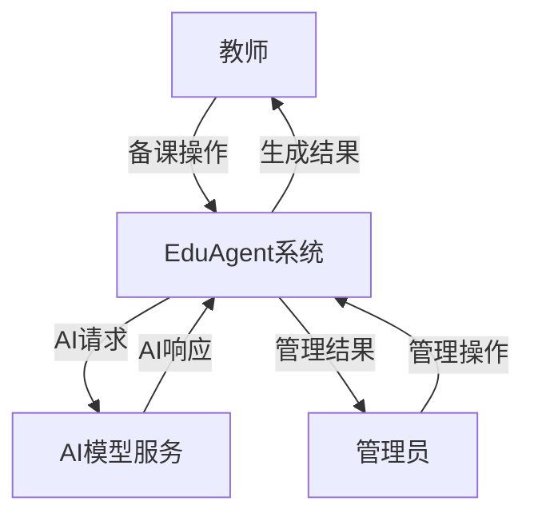

为了提升系统分析的清晰度与可维护性，我们将顶层数据流图进一步分解为多个子模块，每个子模块聚焦于某一具体业务功能。会话管理子系统处理教师的会话创建、查询、编辑、删除等操作，数据存储在会话上下文表和消息表中。对话交互子系统处理教师的消息发送和AI响应接收，涉及RAG检索、LLM调用、SSE流式推送等处理过程。知识库管理子系统处理文档的上传、解析、向量化、检索等操作，数据存储在文档表和向量数据库中。课件生成子系统处理PPT的生成、预览、编辑、导出等操作，数据存储在课件表和生成任务表中。图片管理子系统处理图片的上传、标注、检索等操作，数据存储在图片表和向量数据库中。游戏生成子系统处理游戏的生成、预览、分享等操作，数据存储在游戏表和游戏分享表中。

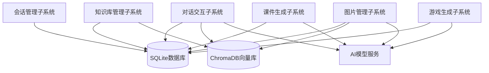

---

## 3. 系统设计

### 3.1 系统架构

为了实现 EduAgent 多模态AI备课工作台的高可扩展性、高并发处理能力及智能化教学支持能力，系统整体采用四层架构设计，包括：前端交互层、接口服务层、后端业务服务层、数据与AI支撑层。各层职责划分明确，通过标准化接口协同工作，实现前后端分离、服务解耦和智能模型的高效接入。这种分层架构的设计理念源于现代Web应用开发的最佳实践，每一层只关注自己的职责，降低了系统的耦合度，提高了可维护性和可扩展性。

前端交互层主要面向教师和管理员等用户角色，提供图形化界面与操作入口。系统采用 React 19 + TypeScript + Vite 构建前端应用，采用组件化开发模式，将界面拆分为多个独立的组件，每个组件负责特定的功能和交互。前端通过 Axios HTTP 客户端与后端进行RESTful API通信，通过 fetch-event-source 库实现SSE流式连接，实时接收AI的思考过程和生成内容。前端采用 Zustand 进行状态管理，将应用状态分为全局状态、游戏状态、通知状态等多个独立的store，实现了状态的模块化管理。前端采用 CSS Modules 进行样式管理，每个组件有独立的样式文件，避免了样式冲突。前端还集成了 KaTeX 数学公式渲染库，支持在聊天消息和讲义预览中实时渲染LaTeX数学公式。

接口服务层位于前端与后端业务之间，统一管理所有HTTP请求与响应，保障系统安全性与接口规范性。后端接口基于 FastAPI 框架构建，提供高性能的RESTful API服务。FastAPI 是一个基于Python的现代Web框架，原生支持ASGI异步协议，能够高效处理并发请求和SSE流式响应。该层引入JWT（JSON Web Token）机制用于用户身份认证，每个需要认证的接口都会验证请求头中的Bearer Token，确保用户身份的合法性。接口服务层还负责请求参数的验证和响应格式的统一，通过Pydantic模型实现自动的数据校验和文档生成。所有接口都遵循统一的响应格式，包含状态码、消息和数据三个字段，便于前端的统一处理。

后端业务服务层负责具体的业务逻辑处理、AI模型调用调度、数据读写控制等，是系统智能功能的核心承载层。所有功能模块均通过模块化方式封装，每个服务类负责特定的业务领域。LLM服务（llm_service.py）负责与大语言模型的交互，包括对话管理、工具调用、SSE流式输出等功能。课件生成器（courseware_generator.py）负责PPT课件的流式生成和非流式生成，支持NDJSON协议的逐页推送。PPT导出器（ppt_exporter.py）负责将结构化的JSON数据转换为标准的.pptx文件，实现了完整的布局渲染、主题应用、LaTeX公式转换等功能。Word导出器（word_exporter.py）负责将Markdown格式的讲义转换为标准的.docx文件。游戏生成器（game_generator.py）负责生成自包含的HTML游戏文件。向量存储服务（vector_store.py）负责文档和图片的向量化存储和检索。图片服务（image_service.py）负责图片的标注、向量化和语义检索。文档解析器（document_parser.py）负责多格式文档的文本提取。视频处理器（video_processor.py）负责视频的音频提取、字幕转写、关键帧分析等功能。

数据与AI支撑层负责系统数据的存储管理、缓存调度以及知识语义检索服务，是系统稳定运行与智能能力的基础支撑。SQLite用于存储系统核心结构化数据，包括用户信息、会话上下文、消息记录、文档元数据、生成任务、课件数据、图片数据、游戏数据等。通过SQLAlchemy ORM框架，系统实现了数据访问层的抽象，当需要切换到MySQL或PostgreSQL等生产数据库时，只需修改数据库连接字符串，无需修改任何业务代码。ChromaDB向量数据库用于存储文档和图片的向量表示，实现语义级别的信息检索。ChromaDB支持本地运行和持久化存储，数据保存在chroma_db目录中，跨进程重启不丢失。该层既支撑了传统教学业务的数据流转，也为智能生成、语义问答等AI功能提供必要的底层能力。

外部AI模型服务层是系统的智能能力来源，包括多个大语言模型和专用模型。文本生成模型（doubao-seed-2-0-pro）用于对话生成、内容理解和工具调用。向量嵌入模型（text-embedding-3-large）用于文档和图片的向量化处理。语音识别模型（whisper-1）用于音频转文字。视觉理解模型（mimo-v2-omni）用于图片标注和视频帧分析。这些模型通过统一的OpenAI兼容接口进行调用，系统通过配置文件管理模型的API地址和密钥，支持灵活的模型切换和扩展。

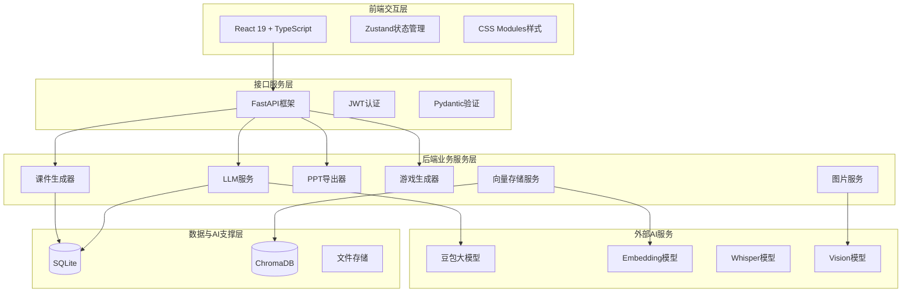

### 3.2 功能模块设计

#### 3.2.1 功能概述

结合需求分析的结果，EduAgent系统的功能模块可以划分为以下几个核心部分：认证与会话管理模块、AI对话交互模块、知识库管理模块、课件生成与导出模块、讲义生成与导出模块、互动游戏生成模块、图片素材管理模块、系统管理模块。这些模块之间通过统一的数据模型和接口规范进行协作，形成了完整的备课工作流。

认证与会话管理模块是系统的基础模块，负责用户身份的验证和会话数据的组织。该模块实现了用户登录、登出、个人信息管理等认证相关功能，以及会话的创建、查询、编辑、删除等管理功能。会话是系统的核心数据容器，所有与备课相关的数据（对话历史、上传文件、生成课件等）都归属于特定的会话。这种设计使得每个备课任务都有独立的数据空间，便于教师管理和查找历史记录。

AI对话交互模块是系统的核心交互模块，负责处理教师与AI之间的多轮对话。该模块通过SSE流式协议实现实时的对话交互，教师可以实时看到AI的思考过程和文本生成过程。模块支持工具调用（Function Calling）机制，当AI判断需要执行结构化操作时，会生成工具调用指令，由后端执行相应操作后将结果反馈给AI。工具集包括PPT方案提案、PPT生成、页面修改、页面新增、页面删除、游戏类型建议、游戏生成等，覆盖了备课工作的主要操作。

知识库管理模块负责文档的上传、解析、向量化存储和语义检索。该模块支持PDF、Word、PPT、TXT等多种格式的文档，通过专用的解析器提取文本内容，然后进行分块和向量化处理，存储到ChromaDB向量数据库中。在对话和生成过程中，模块会自动检索相关的知识片段注入AI的上下文，实现知识增强的生成效果。模块还支持全局知识库和会话级知识库的分层管理，便于知识资产的复用和共享。

课件生成与导出模块负责PPT课件的流式生成、预览、编辑和导出。该模块采用NDJSON流式协议，逐页生成PPT页面数据并实时推送到前端，前端即时渲染为可视化的幻灯片卡片。生成完成后，教师可以对单个页面进行手动编辑或AI迭代修改。导出功能由python-pptx引擎完成，支持完整的布局渲染、主题应用、图片嵌入、LaTeX公式转换等，生成标准的.pptx格式文件。

讲义生成与导出模块负责与PPT配套的Word格式讲义的生成和导出。该模块在PPT生成的同时自动产生Markdown格式的讲义内容，教师可以查看预览、进行迭代修改或直接编辑。导出功能将Markdown转换为标准的.docx格式，自动处理数学公式、表格等复杂内容的渲染。

互动游戏生成模块负责根据教学内容自动生成互动式教学游戏。该模块支持多种游戏类型，包括选择题测验、记忆卡片、填空练习、排序练习、配对练习、闪卡等。游戏以自包含的HTML文件形式生成，支持在线预览和短链接分享。游戏还可以作为卡片插入到PPT课件中，实现课件与互动的无缝衔接。

图片素材管理模块负责图片的上传、标注、向量化存储和语义检索。该模块通过视觉模型自动标注图片内容，生成描述文字和语义标签，然后进行向量化处理。在PPT生成时，模块会自动匹配合适的图片插入到相应位置。模块采用两级图库架构，教师个人图库和管理员全局图库分别管理，生成时优先从个人图库检索，未命中时再从全局图库兜底。

系统管理模块负责用户管理、全局知识库管理、全局图片库管理等后台管理功能。该模块面向管理员用户，提供用户账号的增删改查、密码重置、权限配置等功能，以及全局资源的上传、查看、删除等操作。

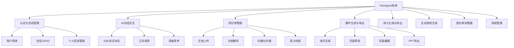

#### 3.2.2 教师侧功能

教师侧功能是系统的核心价值所在，涵盖了备课工作的完整流程。教师通过浏览器访问系统，登录后进入主工作区界面。主工作区采用双栏布局，左侧为对话交互区，右侧为多模态预览区。对话交互区支持文字输入和语音输入，教师可以通过自然语言描述教学需求，AI会实时响应并展示思考过程。多模态预览区支持PPT预览、讲义预览、游戏预览等多种内容的展示，教师可以切换不同的标签页查看不同类型的内容。

在备课流程中，教师首先创建一个新的会话，输入课程名称和目标受众等基本信息。然后教师可以上传教学参考资料，系统会自动进行解析和向量化处理。接下来教师通过对话方式描述教学需求，例如"帮我生成一份关于Python函数的PPT课件"。AI会理解教师的意图，先提出PPT布局方案供教师确认，确认后系统开始正式生成。生成过程采用NDJSON流式协议，逐页生成PPT页面数据并实时推送到前端，教师可以实时看到课件的生成过程。生成完成后，教师可以对单个页面进行手动编辑或通过对话方式进行AI迭代修改，例如"把第3页的标题改一下"或"在第5页后面新增一页"。当教师对课件满意后，可以导出为标准的.pptx文件和.docx文件，用于实际的课堂教学。

教师还可以利用系统的互动游戏功能，根据教学内容生成互动式教学游戏。教师在对话中表达生成游戏的意图，AI会建议适合的游戏类型，教师确认后系统开始生成。游戏以自包含的HTML文件形式生成，教师可以在线预览效果，也可以通过短链接分享给学生。游戏还可以作为卡片插入到PPT课件中，实现课件与互动的无缝衔接。

PPT导出引擎是系统技术含量最高的模块之一，实现了从JSON数据到物理.pptx文件的完整转换。该引擎基于python-pptx库构建，内部实现了多种布局渲染器，包括封面页渲染器、要点列表页渲染器、双栏对比页渲染器、数据强调页渲染器、时间线页渲染器等。每种布局渲染器都有专门的元素定位和排版逻辑，确保生成的课件具有专业的视觉效果。引擎还实现了完整的LaTeX到OMML转换引擎，支持分数、根号、求和、积分、极限、矩阵等20多种LaTeX命令结构的渲染，转换后的数学公式以原生Office Math对象的形式嵌入PPT文件，在Microsoft PowerPoint中可以进行二次编辑。引擎内置了10个精心设计的主题模板，包括6个亮色主题和4个暗色主题，支持自定义颜色方案。每个主题都定义了背景色、文字颜色、强调色等配色参数，以及背景装饰图形的样式。引擎还实现了WCAG对比度自动守护功能，在应用主题时自动校验背景色与文字颜色的对比度，确保符合无障碍标准。

Word导出器负责将Markdown格式的讲义转换为标准的.docx文件。导出器内部实现了完整的Markdown解析逻辑，支持标题、段落、列表、表格、代码块、数学公式等丰富的内容格式。对于数学公式，导出器同样实现了LaTeX到OMML的转换，确保数学内容在Word文档中能够正确渲染。导出器还支持中文字体的设置，默认使用宋体作为正文字体，确保中英文混排的视觉效果。

游戏生成器负责生成自包含的HTML游戏文件。生成器调用大语言模型生成完整的HTML代码，代码中包含了游戏的所有逻辑、样式和交互设计。生成器约束模型输出符合特定的格式要求，包括使用iframe sandbox兼容的HTML结构、无外部资源依赖、支持响应式布局等。生成器支持多种游戏类型的生成，每种类型都有对应的System Prompt模板，引导模型生成符合该类型特点的游戏内容。生成器还支持游戏的精炼修改，教师可以对已生成的游戏提出修改意见，系统会基于现有HTML进行增量修改。

#### 3.2.3 管理员侧功能

管理员侧功能聚焦于系统管理和资源维护，为系统的稳定运行和持续优化提供支撑。管理员通过专用的管理界面进行操作，拥有比普通教师更高的权限级别。管理员侧的界面设计相对简洁，主要分为用户管理、知识库管理、图片库管理等功能模块。

在用户管理方面，管理员可以查看系统内的所有用户列表，支持按用户名、姓名、部门等条件进行筛选。管理员可以添加新用户，指定用户名、姓名、部门等基本信息，系统自动生成唯一用户ID并设置默认密码。管理员可以删除用户，删除时会同时清理该用户的所有关联数据。管理员可以重置用户密码，帮助忘记密码的用户恢复访问。

在知识库管理方面，管理员可以上传全局知识库文档，这些文档可供所有教师在备课时引用和检索。管理员可以查看文档列表，编辑文档的名称和描述等元数据，删除不再需要的文档。对于处理失败的文档，管理员可以触发重试操作。管理员还可以查看文档的处理状态和进度，了解知识库的建设情况。

在图片库管理方面，管理员可以上传全局图片素材，这些图片在教师个人图片库未命中匹配时作为兜底资源使用。管理员可以查看图片列表，预览图片效果，删除不再需要的图片。上传的图片会自动进行视觉标注和向量化处理，便于后续的语义检索。

### 3.3 数据库设计

#### 3.3.1 数据库概念设计

EduAgent系统的数据库采用关系型数据库SQLite（开发阶段）进行结构化数据的存储，同时使用ChromaDB向量数据库进行向量数据的存储。关系型数据库存储了系统的核心业务数据，包括用户信息、会话上下文、消息记录、文档元数据、生成任务、课件数据、图片数据、游戏数据等。向量数据库存储了文档和图片的向量表示，用于语义检索。

从实体关系的角度来看，系统中存在以下核心实体及其关系。用户（User）是系统的核心实体，一个用户可以创建多个会话，一个会话只属于一个用户，用户与会话之间是一对多的关系。会话（SessionContext）是备课任务的容器，一个会话包含多条消息、多个文件、一个课件、多个游戏，会话与这些实体之间都是一对多的关系。消息（Message）是对话的基本单位，每条消息属于一个会话，包含角色（用户或AI）和内容。文档（Document）是知识库的基本单位，可以是全局文档或会话关联文档，包含文件名、路径、状态、摘要等信息。生成任务（GenerationTask）记录了课件生成、导出、游戏生成等异步任务的状态和进度。课件（Courseware）存储了PPT的结构化数据和讲义的Markdown内容，与会话之间是一对一的关系。图片（UserImage和ImageLibrary）存储了用户图片和全局图片的元数据，包含文件名、路径、描述、标签、向量ID等信息。游戏（Game）存储了游戏的元数据和HTML文件信息，游戏分享（GameShare）存储了游戏的短链接信息。

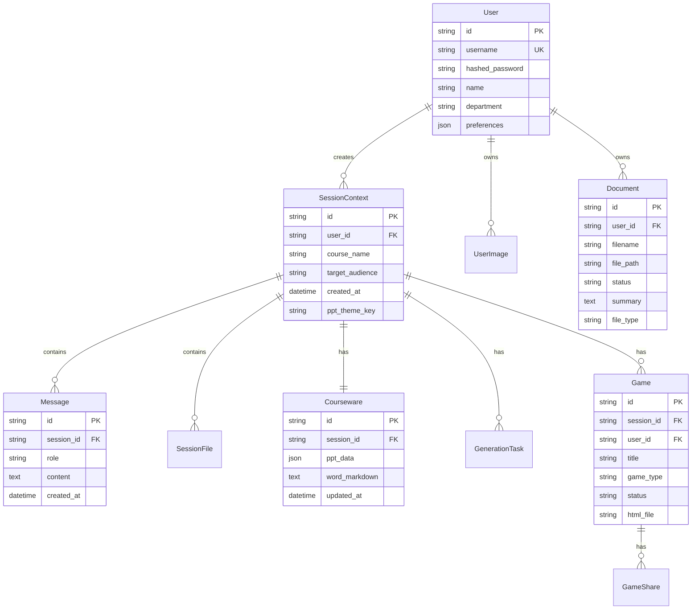

#### 3.3.2 数据库逻辑设计

数据库逻辑设计是将概念模型转换为具体的数据库表结构的过程。EduAgent系统共设计了11张数据表，分别是User（用户表）、SessionContext（会话上下文表）、Message（消息表）、SessionFile（会话文件表）、Document（文档表）、GenerationTask（生成任务表）、Courseware（课件表）、UserImage（用户图片表）、ImageLibrary（图片库表）、Game（游戏表）、GameShare（游戏分享表）。每张表都有明确的字段定义和约束条件，通过外键建立表之间的关联关系。

用户表（User）存储了系统用户的基本信息，包括用户ID、用户名、密码哈希、显示名称、部门、个性化偏好等字段。用户ID采用"u_"前缀加8位UUID的格式，确保全局唯一性。用户名设置唯一约束，防止重复注册。密码采用bcrypt算法进行哈希存储，确保安全性。个性化偏好采用JSON格式存储，包含主题、语言、默认AI模型等配置信息。

会话上下文表（SessionContext）存储了备课会话的元数据，包括会话ID、用户ID、课程名称、目标受众、创建时间、PPT主题偏好等字段。会话ID采用"sess_"前缀加8位UUID的格式。用户ID作为外键关联用户表，建立会话与用户的归属关系。PPT主题偏好和自定义颜色采用JSON格式存储，支持灵活的主题配置。

消息表（Message）存储了对话消息的内容，包括消息ID、会话ID、角色、内容、创建时间等字段。消息ID采用"msg_"前缀加12位UUID的格式。会话ID作为外键关联会话表，建立消息与会话的归属关系。角色字段区分用户消息和AI消息。内容字段存储消息的文本内容，支持Markdown格式。

文档表（Document）存储了知识库文档的元数据，包括文档ID、用户ID、文件名、文件路径、状态、进度、摘要、元数据、创建时间、文件类型等字段。文档ID采用"doc_"前缀加8位UUID的格式。文件类型区分普通文档和视频文档，视频文档还包含时长、处理阶段、字幕、关键帧、视频摘要等额外字段。状态字段记录文档的处理状态，包括待处理、处理中、已完成、失败等。

课件表（Courseware）存储了PPT课件的结构化数据和讲义内容，包括课件ID、会话ID、PPT数据、讲义Markdown、创建时间、更新时间等字段。课件ID采用"cw_"前缀加8位UUID的格式。会话ID设置唯一约束，确保一个会话只有一个课件。PPT数据采用JSON格式存储，包含版本号、主题配置、页面数组等结构化信息。

游戏表（Game）存储了互动游戏的元数据，包括游戏ID、会话ID、用户ID、标题、游戏类型、状态、HTML文件名、错误信息、规格JSON、版本号、创建时间、更新时间等字段。游戏ID采用"game_"前缀加8位UUID的格式。游戏类型支持多种选择，包括quiz、memory、fillblank、sort、match、flashcard、custom等。

游戏分享表（GameShare）存储了游戏的短链接信息，包括短码、游戏ID、创建者、创建时间、过期时间、查看次数、是否启用等字段。短码采用6-8位Base62编码，确保短链接的简洁性。过期时间支持NULL值，表示永不过期。查看次数用于统计游戏的访问量。

### 3.4 接口设计

#### 3.4.1 接口返回字段设计

EduAgent系统的API接口遵循RESTful设计规范，所有接口都采用统一的请求和响应格式。API前缀为`/api/v1`，通过版本号管理接口的演进。接口采用标准的HTTP方法表示操作类型，GET用于查询、POST用于创建和触发操作、PUT用于更新、DELETE用于删除、PATCH用于部分更新。

接口的响应格式采用统一的JSON结构，包含code（状态码）、message（消息）、data（数据）三个字段。状态码采用HTTP标准状态码，200表示成功，400表示客户端错误，500表示服务端错误。消息字段提供人类可读的描述信息，便于调试和用户提示。数据字段承载具体的业务数据，可以是对象、数组或null。

对于分页查询接口，响应数据采用统一的分页格式，包含current（当前页码）、records（数据列表）、size（每页记录数）、total（总记录数）四个字段。前端可以根据这些信息实现分页导航和数据展示。

对于SSE流式接口，响应采用text/event-stream格式，每个事件包含event_type（事件类型）和对应的负载数据。事件类型包括thinking（深度思考）、text（普通文本）、tool_call（工具调用）、tool_result（工具结果）、game_suggest（游戏建议）、game_trigger（游戏触发）等。前端根据事件类型进行相应的处理和展示。

#### 3.4.2 JWT + RBAC 权限控制机制

EduAgent系统采用JWT（JSON Web Token）进行身份认证，采用RBAC（Role-Based Access Control）进行权限控制。这种组合机制既保证了接口的安全性，又提供了灵活的权限管理能力。

JWT认证的流程如下：用户通过登录接口提交用户名和密码，后端验证通过后生成JWT Token返回给前端。Token中包含用户ID、用户名、角色等信息，以及过期时间。前端将Token保存在localStorage中，后续每个请求都在Authorization请求头中携带Bearer Token。后端通过统一的依赖注入函数验证Token的合法性和有效性，提取用户信息供后续业务逻辑使用。当Token过期或无效时，接口返回401状态码，前端清除本地Token并重定向到登录页面。

RBAC权限控制的实现方式是：系统定义了admin和user两种角色，不同角色拥有不同的接口访问权限。管理员接口（如用户管理、全局资源管理）需要admin角色才能访问，普通用户接口（如会话管理、课件生成）需要user角色即可访问。权限检查通过FastAPI的依赖注入机制实现，在路由函数执行之前进行角色验证，权限不足时返回403状态码。

数据权限的控制方式是：用户只能访问自己创建的数据，不能访问其他用户的数据。例如，用户只能查看和编辑自己的会话，不能查看其他用户的会话。数据权限的检查在业务逻辑层实现，通过比对当前用户ID和数据记录的user_id字段来判断权限。

### 3.5 界面设计

#### 3.5.1 全部用户

登录页面是所有用户进入系统的第一个页面，采用简洁的居中布局设计。页面中央是一个登录表单卡片，包含系统Logo、标题、用户名输入框、密码输入框和登录按钮。表单支持Enter键快捷提交，输入框有实时的格式验证和错误提示。登录成功后，系统会自动跳转到主界面；登录失败时，会在表单下方显示错误信息。页面背景采用渐变色设计，营造专业的视觉氛围。

#### 3.5.2 教师侧

教师侧的主工作区是系统最核心的页面，采用双栏布局设计。左侧为对话交互区，约占40%的宽度，包含会话列表侧边栏和消息展示区域。会话列表侧边栏显示教师的所有备课会话，支持新建会话、搜索会话、删除会话等操作。消息展示区域显示当前会话的对话历史，支持Markdown渲染、代码高亮、数学公式渲染等功能。底部为输入区域，支持文字输入和语音输入，以及文件上传功能。

右侧为多模态预览区，约占60%的宽度，通过标签页切换展示不同类型的内容。PPT预览标签页展示AI生成的课件页面，每个页面渲染为可视化的幻灯片卡片，支持手动编辑和AI迭代修改。讲义预览标签页展示配套的Word格式讲义，支持Markdown渲染和编辑。游戏预览标签页展示生成的互动游戏，通过iframe嵌入HTML游戏文件。导出操作条位于预览区顶部，提供PPT导出、Word导出、主题选择等操作按钮。

PPT预览页面是前端最核心的展示组件，内部实现了复杂的渲染逻辑。页面根据layout_type属性选择对应的CSS Grid或Flex布局模板，支持封面页、要点列表页、双栏对比页、数据强调页、时间线页等多种布局类型。页面集成了KaTeX数学公式渲染功能，能够自动扫描内容中的LaTeX片段并渲染为HTML。页面支持图片元素的渲染，优先使用向量检索匹配的图片URL，未匹配时显示灰色占位框。页面通过CSS Custom Properties注入主题变量，实现主题的动态切换。

#### 3.5.3 学生侧

学生通过教师分享的短链接访问互动游戏页面，无需登录即可使用。游戏页面采用全屏iframe嵌入游戏HTML文件，提供沉浸式的游戏体验。页面顶部显示游戏标题和返回按钮，底部显示游戏状态信息。游戏支持多种交互方式，包括点击选择、拖拽排序、文本输入等，根据游戏类型的不同而有所差异。

#### 3.5.4 管理侧

管理侧界面采用标准的后台管理布局，左侧为功能导航菜单，右侧为内容展示区域。导航菜单包含用户管理、知识库管理、图片库管理等功能入口，当前选中的菜单项高亮显示。内容区域根据选中的功能模块展示相应的管理界面，支持表格展示、搜索筛选、分页导航等通用功能。

用户管理页面展示系统内的所有用户列表，支持按角色、用户名、姓名等条件进行筛选。每个用户记录显示基本信息和操作按钮，包括编辑、删除、重置密码等操作。页面顶部提供添加用户的按钮，点击后弹出用户信息填写表单。

知识库管理页面展示全局知识库的文档列表，支持按文件名、状态、上传时间等条件进行筛选。每个文档记录显示文件名、类型、大小、状态、上传时间等信息，以及预览、下载、删除等操作按钮。页面顶部提供上传文档的按钮，支持拖拽上传和点击选择上传。

图片库管理页面展示全局图片库的图片列表，支持按分类、标签等条件进行筛选。图片以缩略图网格的形式展示，每个图片卡片显示预览图、文件名、分类、描述等信息，以及预览、删除等操作按钮。页面顶部提供上传图片的按钮，支持多选上传。

### 3.6 详细设计

#### 3.6.1 时序图与系统流程图

为了清晰地展示系统中各个功能的执行流程和组件之间的交互关系，本节采用时序图和流程图进行详细设计。时序图展示了对象之间按时间顺序排列的交互，流程图展示了业务流程的逻辑判断和处理步骤。

**用户登录流程**展示了教师或管理员从打开登录页面到成功登录系统的完整过程。用户在登录页面输入用户名和密码，点击登录按钮后，前端将凭证发送到后端的登录接口。后端首先验证用户名是否存在，然后验证密码是否正确，验证通过后生成JWT Token返回给前端。前端将Token保存到localStorage中，然后跳转到主界面。如果验证失败，后端返回错误信息，前端显示提示。

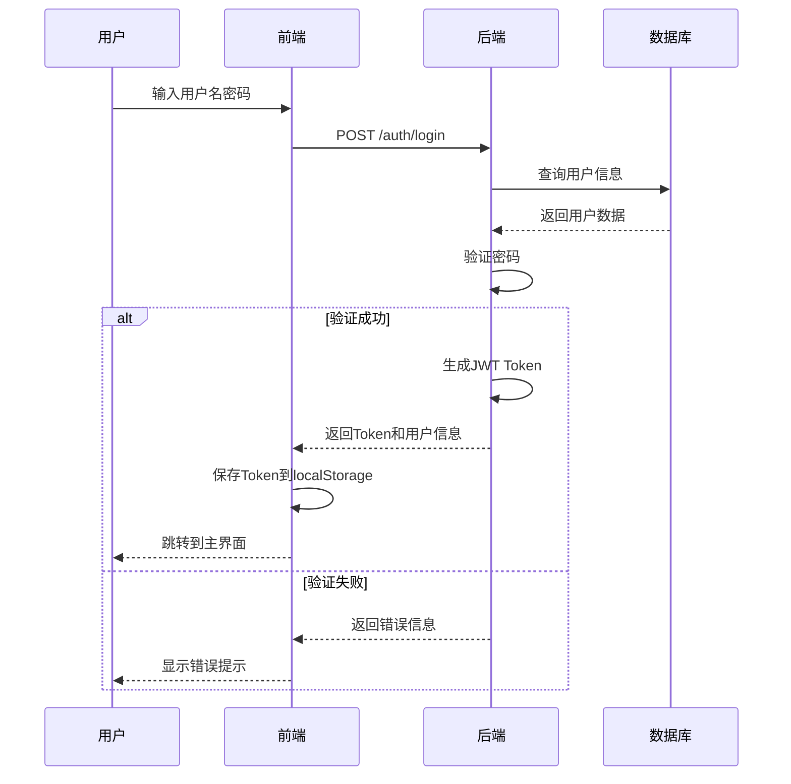

**对话交互流程**展示了教师发送消息到收到AI响应的完整过程。教师在输入框中输入消息并发送，前端通过SSE连接将消息发送到后端。后端首先保存用户消息到数据库，然后检索相关的知识库片段，构建包含上下文的Prompt，调用大语言模型进行生成。模型的输出以流式方式返回，后端将每个token作为SSE事件推送到前端。前端实时渲染AI的思考过程和文本内容，提供打字机效果的交互体验。如果AI判断需要调用工具，后端会执行相应的操作，然后将结果反馈给AI继续生成。

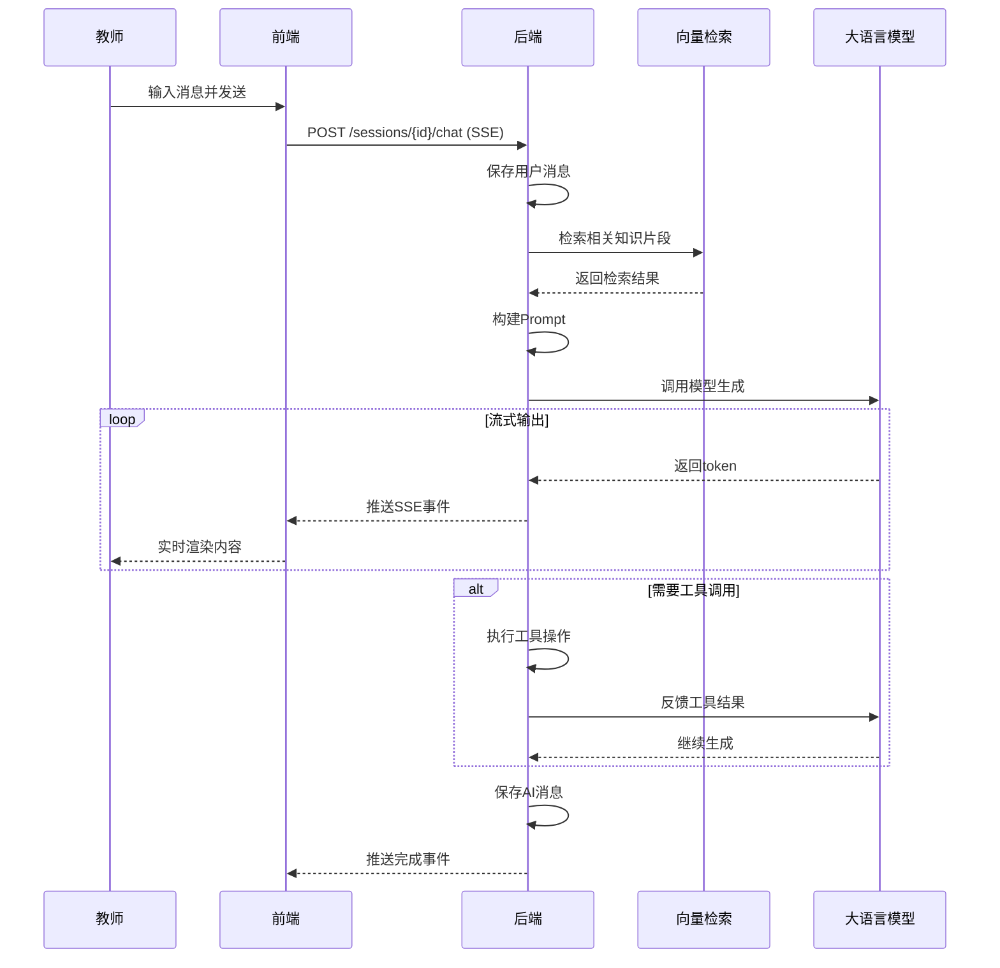

**课件生成流程**展示了从教师表达生成意图到课件生成完成的完整过程。教师在对话中表达生成PPT的意图，AI会先调用ProposePPTPlan工具提出布局方案，前端展示方案供教师确认。教师确认后，AI调用GenerateFullPPT工具触发正式生成。前端连接SSE流式接口，后端开始逐页生成PPT页面数据。每生成一个页面，后端就将页面数据作为SSE事件推送到前端，前端即时渲染为可视化的幻灯片卡片。同时，后端还会对页面中的图片元素进行向量检索，自动匹配合适的图片。生成完成后，后端将完整的PPT数据和讲义内容保存到数据库。

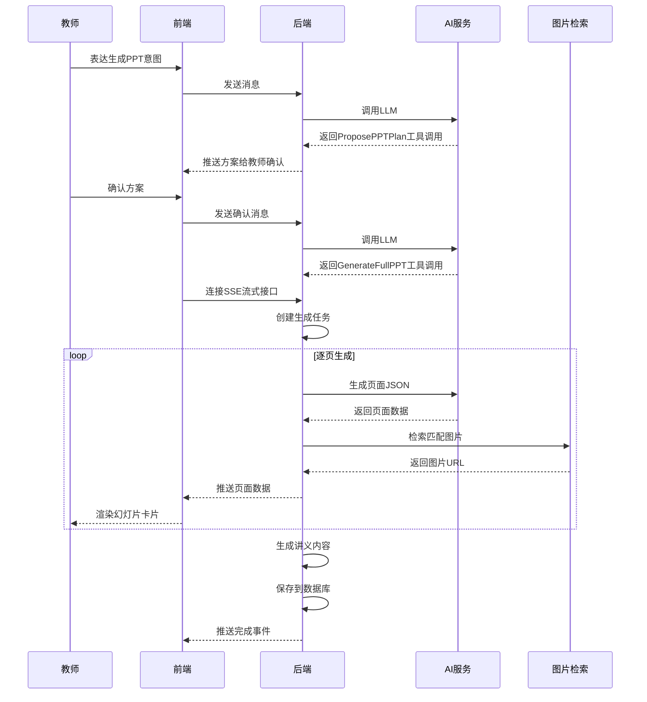

**PPT导出流程**展示了从教师触发导出到下载文件的完整过程。教师点击导出按钮，前端调用导出接口。后端创建导出任务，从数据库读取课件的PPT数据，然后调用python-pptx引擎进行渲染。渲染过程包括创建幻灯片、应用主题、添加背景装饰、渲染各个元素（标题、文本、图片、表格、数学公式等）。渲染完成后，后端将.pptx文件保存到导出目录，更新任务状态。前端通过轮询查询任务状态，当任务完成时获取下载链接，触发文件下载。

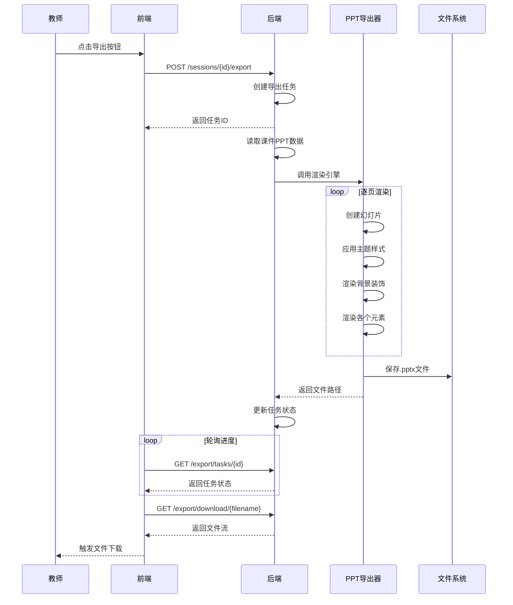

**游戏生成流程**展示了从教师表达生成意图到游戏可预览的完整过程。教师在对话中表达生成游戏的意图，AI会调用ProposeGameTypes工具建议适合的游戏类型，前端展示建议供教师确认。教师确认后，AI调用GenerateGame工具触发游戏生成。后端创建游戏记录和生成任务，启动后台线程调用大语言模型生成HTML代码。生成的HTML代码以流式方式通过SSE推送到前端，前端实时展示代码块。生成完成后，HTML文件保存到游戏目录，教师可以在线预览或通过短链接分享。

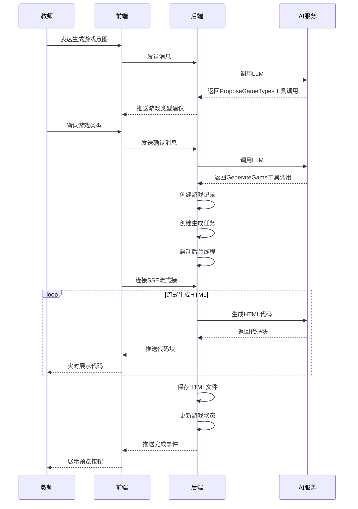

#### 3.6.2 类图

EduAgent系统的后端采用面向对象的设计方法，通过类图展示核心业务类的属性和方法，以及类之间的关系。类图是UML（统一建模语言）中的一种静态结构图，用于描述系统的类、接口、协作和依赖关系。

系统的类图主要包含以下核心类。User类表示系统用户，包含id、username、hashed_password、name、department、preferences等属性。SessionContext类表示备课会话，包含id、user_id、course_name、target_audience等属性，以及与User、Message、SessionFile、Courseware、Game等类的关联关系。Message类表示对话消息，包含id、session_id、role、content等属性。Document类表示知识库文档，包含id、user_id、filename、file_path、status、summary等属性。Courseware类表示课件，包含id、session_id、ppt_data、word_markdown等属性。Game类表示互动游戏，包含id、session_id、user_id、title、game_type、status、html_file等属性。

在服务层，LLMService类负责与大语言模型的交互，包含chat_stream方法用于流式对话，execute_tool方法用于执行工具调用。CoursewareGenerator类负责课件的生成，包含stream_generation方法用于流式生成，run_generation_task方法用于非流式生成。PPTExporter类负责PPT的导出，包含export方法用于导出.pptx文件，_render_slide方法用于渲染单个幻灯片。WordExporter类负责Word的导出，包含export方法用于导出.docx文件。GameGenerator类负责游戏的生成，包含generate方法用于生成HTML文件。VectorStore类负责向量的存储和检索，包含store_document_vectors方法用于存储文档向量，similarity_search方法用于相似度检索。ImageService类负责图片的管理，包含annotate_image方法用于标注图片，search_image_by_query方法用于图片检索。

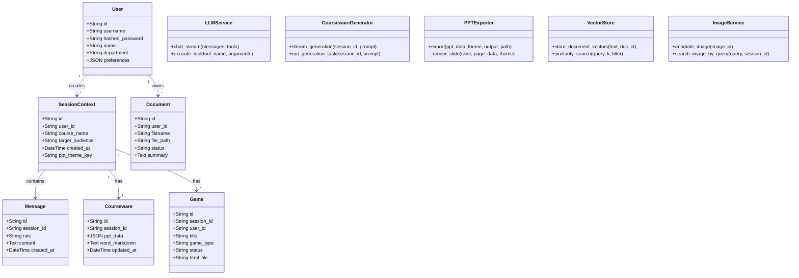

---

## 4. 算法设计

### 4.1 AI 模块整体架构

EduAgent系统的AI模块是整个系统的智能核心，负责实现对话生成、知识检索、内容生成、图片标注、视频处理等关键功能。AI模块的整体架构采用分层设计，包括模型调用层、能力封装层和业务应用层三个层次。模型调用层负责与外部AI模型服务的通信，通过统一的OpenAI兼容接口调用各个模型。能力封装层将模型调用封装为具体的AI能力，如对话生成、向量嵌入、视觉理解等。业务应用层将AI能力与具体的业务场景结合，实现课件生成、知识检索、图片标注等功能。

在模型调用层，系统通过httpx异步客户端与AI模型服务进行通信。所有模型调用都遵循OpenAI的API规范，包括请求格式、响应格式、流式输出协议等。这种统一的调用方式使得系统可以灵活地切换不同的模型服务商，只需修改配置文件中的API地址和密钥即可。系统支持流式输出，即模型生成的每个token都能实时返回，提供了打字机效果的交互体验。系统还支持深度思考模式，能够输出模型的推理过程，帮助用户理解AI的决策逻辑。

在能力封装层，系统将模型调用封装为多个独立的服务类。LLMService负责对话生成和工具调用，维护对话历史和工具定义，处理流式输出和工具调用的拼装逻辑。VectorStore负责向量的存储和检索，将文本转换为向量表示，存储到ChromaDB中，并提供相似度检索功能。ImageService负责图片的标注和检索，通过视觉模型生成图片描述和标签，然后进行向量化存储和语义检索。

在业务应用层，系统将AI能力与具体的业务场景结合。CoursewareGenerator利用LLMService和VectorStore实现课件的流式生成，通过NDJSON协议逐页推送PPT页面数据。GameGenerator利用LLMService生成自包含的HTML游戏文件。DocumentProcessor利用VectorStore实现文档的解析和向量化处理。VideoProcessor利用Whisper和Vision模型实现视频的音频提取、字幕转写、关键帧分析等功能。

### 4.2 大语言模型选型说明

为支撑EduAgent系统的智能化功能，包括对话生成、内容理解、工具调用、课件生成等多种任务，本项目在技术选型阶段对当前主流大语言模型进行了充分对比与实验验证，最终选取了豆包大模型（doubao-seed-2-0-pro）作为主要的文本生成模型。选型的决策依据主要包括以下几个方面。

从模型能力来看，豆包大模型在中文理解和生成方面表现出色，能够准确理解教师的教学需求并生成高质量的内容。模型支持工具调用（Function Calling）机制，能够根据上下文判断是否需要调用工具，并生成符合规范的调用指令。模型支持流式输出，能够逐token返回生成结果，提供流畅的交互体验。模型还支持深度思考模式，能够输出推理过程，帮助用户理解生成逻辑。

从服务稳定性来看，豆包大模型由字节跳动提供服务，具备完善的基础设施和技术支持。API服务具有高可用性和低延迟，能够满足系统的性能要求。服务提供了详细的文档和技术支持，便于开发过程中的问题排查。

从成本效益来看，豆包大模型的API调用价格相对合理，适合中小型应用场景的成本预算。模型提供了灵活的计费方式，支持按调用量计费，便于控制成本。

从可扩展性来看，系统采用统一的模型调用接口，当需要切换或新增模型时，只需修改配置文件即可，无需修改业务代码。系统还支持多模型调度策略，可以根据任务类型自动选择最合适的模型进行处理。

### 4.3 相关技术介绍

#### 4.3.1 向量数据库

向量数据库是EduAgent系统的核心底座之一，承担着知识语义存储与高速检索的关键任务。系统通过将教材、课件、教学文档等结构化或非结构化资料进行语义嵌入处理，构建语义层面的向量索引，支持面向知识的智能问答、内容生成与个性化教学服务。向量数据库的引入使得系统能够实现真正的语义检索，而不是简单的关键词匹配，大大提升了检索的准确性和相关性。

EduAgent系统采用ChromaDB作为向量数据库，这是一个开源的向量数据库，专为AI应用设计。ChromaDB具有多项适合本项目的技术特性：支持本地运行和持久化存储，无需独立部署，降低了系统的运维复杂度；支持metadata过滤，可以在检索时按文档ID、用户ID等条件进行过滤，实现精确检索；支持多种距离度量方式，包括余弦相似度、欧氏距离等，满足不同场景的检索需求；提供了简洁的Python API，便于与LangChain框架集成。

向量数据库的构建过程包括文档解析、文本分块、向量嵌入和索引存储四个步骤。文档解析阶段将PDF、Word、PPT等格式的文档转换为纯文本。文本分块阶段将长文本切分为适合向量化的短片段，采用RecursiveCharacterTextSplitter进行分块，分块大小为1000字符，重叠150字符，确保上下文的连贯性。向量嵌入阶段将文本片段通过text-embedding-3-large模型转换为高维向量表示。索引存储阶段将向量和对应的元数据存储到ChromaDB中，建立高效的检索索引。

向量检索的过程是构建的逆过程。当用户发起查询时，系统将查询文本同样转换为向量表示，然后计算与数据库中所有向量的相似度，返回Top-K个最相似的结果。检索结果包含文本内容和相似度分数，系统根据分数进行排序和过滤，确保返回的结果与查询高度相关。系统还支持metadata过滤，可以按文档ID、用户ID等条件缩小检索范围，提高检索的精确度。

#### 4.3.2 RAG技术的详述及应用

RAG（Retrieval-Augmented Generation）检索增强生成技术是EduAgent系统实现知识增强生成的核心机制。RAG技术的核心思想是：在生成回答之前，先从外部知识库中检索相关文档片段，将其作为上下文注入到大模型的Prompt中，从而提升生成内容的准确性和时效性。这种技术范式特别适合教育场景，能够有效解决大模型"幻觉"问题，确保生成内容的专业性和可追溯性。

在EduAgent系统中，RAG技术的应用贯穿于多个核心功能模块。在对话交互模块中，当教师发送消息时，系统会自动检索与消息内容相关的知识库片段，将检索结果注入到Prompt中，使AI的回复能够引用具体的教学资料内容。在课件生成模块中，当系统生成PPT页面时，会检索与页面主题相关的知识片段，确保生成内容的专业性和准确性。在游戏生成模块中，系统会检索与游戏主题相关的知识内容，生成与教学资料紧密结合的互动游戏。

RAG技术的实现流程包括查询构建、向量检索、上下文组装和生成调用四个步骤。查询构建阶段从用户的输入中提取关键信息，构建检索查询。向量检索阶段将查询转换为向量，在向量数据库中检索最相关的Top-K个文档片段。上下文组装阶段将检索到的文档片段按照相关性排序，组装成结构化的上下文信息。生成调用阶段将上下文信息注入到Prompt中，调用大语言模型生成回答。

为了提升RAG的检索效果，系统采用了多项优化策略。首先是分块策略的优化，采用RecursiveCharacterTextSplitter进行文本分块，分块大小为1000字符，重叠150字符，确保每个分块都有完整的语义表达。其次是检索策略的优化，采用相似度阈值过滤，只返回相似度高于阈值的结果，确保检索结果的质量。第三是上下文组装的优化，对检索结果进行去重和排序，避免重复信息的干扰。第四是Prompt工程的优化，设计了专门的Prompt模板，引导模型有效利用检索到的上下文信息。

### 4.4 具体算法设计

#### 4.4.1 问答模块算法设计

问答模块是EduAgent系统的核心功能之一，负责处理教师与AI之间的多轮对话。问答模块的算法设计需要解决几个关键问题：如何维护多轮对话的上下文、如何进行知识检索增强、如何处理工具调用、如何实现流式输出。

在多轮对话上下文维护方面，系统采用消息列表的方式维护对话历史。每次用户发送消息时，系统将用户消息添加到消息列表中；每次AI回复时，系统将AI回复也添加到消息列表中。消息列表作为Prompt的一部分发送给大语言模型，使模型能够理解对话的上下文。为了控制Prompt的长度，系统会对消息列表进行截断，只保留最近的N条消息。

在知识检索增强方面，系统在每次对话时都会自动检索相关的知识库片段。检索的查询来自用户的最新消息，检索的范围包括用户上传的文档和全局知识库文档。检索结果按照相关性排序，取Top-K个结果注入到Prompt中。为了提升检索的准确性，系统支持按文档ID进行过滤，只检索用户选择的参考文档。

在工具调用处理方面，系统定义了一组工具函数，包括PPT方案提案、PPT生成、页面修改、页面新增、页面删除、游戏类型建议、游戏生成等。当大语言模型判断需要调用工具时，会生成工具调用指令，包含工具名称和参数。系统解析工具调用指令，执行相应的操作，然后将操作结果反馈给模型，模型继续生成回复。工具调用的参数是分块到达的JSON字符串片段，系统维护缓冲区进行拼接，流结束后统一解析执行。

在流式输出方面，系统采用SSE（Server-Sent Events）协议实现实时的流式推送。大语言模型的输出以token为单位返回，系统将每个token封装为SSE事件推送到前端。前端接收到事件后，实时渲染AI的思考过程和文本内容，提供打字机效果的交互体验。系统还支持深度思考模式，能够输出模型的推理过程，帮助用户理解AI的决策逻辑。

#### 4.4.2 多类型内容生成算法设计

EduAgent系统支持多种类型内容的生成，包括PPT课件、Word讲义、互动游戏等。不同类型的内容生成有不同的算法设计。

PPT课件生成算法采用NDJSON流式协议，逐页生成PPT页面数据并实时推送到前端。算法的输入是教师的教学需求描述和知识库检索结果，输出是结构化的PPT页面JSON数据。算法首先调用大语言模型生成PPT的整体方案，包括页面数量、每页的布局类型和内容大纲。然后逐页生成每个页面的详细内容，包括标题、文本元素、图片元素、表格元素等。对于图片元素，算法会自动进行向量检索，匹配合适的图片。生成完成后，算法还会生成配套的讲义Markdown内容。

Word讲义生成算法在PPT生成的同时自动执行，将PPT的内容转换为详细的讲义文字。算法首先解析PPT的页面结构和内容，然后调用大语言模型生成每个页面的详细讲解。生成的讲义以Markdown格式存储，支持标题、段落、列表、表格、数学公式等丰富的内容格式。讲义导出时，系统将Markdown转换为标准的.docx格式，自动处理数学公式、表格等复杂内容的渲染。

互动游戏生成算法调用大语言模型生成自包含的HTML游戏文件。算法的输入是游戏类型和教学内容，输出是完整的HTML代码。算法首先根据游戏类型构建对应的System Prompt，约束模型输出符合特定的格式要求。然后调用大语言模型生成HTML代码，代码以流式方式返回，系统实时推送到前端。生成的HTML文件需要满足多项要求：使用iframe sandbox兼容的结构、无外部资源依赖、支持响应式布局、包含完整的游戏逻辑和交互设计。

#### 4.4.3 教案与题目生成模块

教案生成模块是EduAgent系统的重要功能之一，负责根据教师的教学需求自动生成结构化的教学设计方案。教案生成的算法流程包括需求理解、知识检索、内容生成和格式化输出四个步骤。

在需求理解阶段，系统解析教师输入的教学需求描述，提取课程名称、教学主题、目标受众、教学目标等关键信息。这些信息作为后续内容生成的约束条件。在知识检索阶段，系统根据提取的关键信息进行向量检索，找到与教学主题相关的知识片段。检索结果作为内容生成的参考资料，确保生成内容的专业性和准确性。在内容生成阶段，系统调用大语言模型，结合需求信息和检索结果，生成结构化的教学设计方案。方案通常包含教学目标、知识讲解、教学活动、时间安排等内容模块。在格式化输出阶段，系统将生成的内容转换为标准的PPT和Word格式，便于教师使用。

题目生成模块负责根据教学内容自动生成各种类型的练习题和测试题。题目生成的算法流程与教案生成类似，也包括需求理解、知识检索、内容生成和格式化输出四个步骤。系统支持多种题型的生成，包括选择题、填空题、简答题等。生成的题目会自动标注难度系数、知识点标签、所属章节等属性，便于教师进行筛选和组卷。

#### 4.4.4 学情分析模块

学情分析模块负责对学生的学习数据进行分析，生成学情报告和教学建议。学情分析的算法流程包括数据采集、数据处理、分析建模和报告生成四个步骤。

在数据采集阶段，系统收集学生的各种学习数据，包括作业完成情况、考试成绩、练习记录、错题记录等。这些数据存储在数据库中，为后续的分析提供数据基础。在数据处理阶段，系统对采集的数据进行清洗和整理，去除异常值和重复数据，计算各种统计指标，如平均分、正确率、完成率等。在分析建模阶段，系统运用统计分析和机器学习算法，对学生的学情进行多维度分析。分析维度包括知识点掌握情况、学习进度、学习习惯、薄弱环节等。系统还会识别学生的学习模式，如哪些知识点掌握较好、哪些知识点需要加强等。在报告生成阶段，系统将分析结果以可视化图表和文字描述的形式呈现，生成个性化的学情报告和教学建议。

#### 4.4.5 多模型策略与适配机制

EduAgent系统采用多模型策略，根据不同任务的特点选择最合适的模型进行处理。多模型策略的实现包括模型注册、任务路由、负载均衡和降级兜底四个机制。

模型注册机制维护了一个模型配置表，记录了每个模型的能力特点、适用场景、调用方式等信息。系统支持动态添加和删除模型，无需修改业务代码。任务路由机制根据任务类型自动选择最合适的模型。例如，对话生成任务选择擅长自然语言理解的模型，向量嵌入任务选择专门的嵌入模型，视觉理解任务选择多模态模型。负载均衡机制在多个模型之间分配请求，避免单个模型过载。系统支持多种负载均衡策略，如轮询、加权轮询、最少连接等。降级兜底机制在主模型调用失败时自动切换到备用模型，确保系统的可用性。系统会记录模型调用的成功率和响应时间，当主模型的指标低于阈值时自动触发降级。

#### 4.4.6 视频处理算法设计

视频处理模块负责对上传的教学视频进行分析和处理，提取有价值的教学内容。视频处理的算法流程包括元数据提取、音频提取、语音转写、关键帧提取、视觉分析和摘要生成六个步骤。

在元数据提取阶段，系统使用FFmpeg读取视频文件的基本信息，包括时长、分辨率、编码格式、帧率等。这些信息用于后续处理的参数设置和进度估算。在音频提取阶段，系统使用FFmpeg从视频中分离音频轨道，保存为WAV格式的临时文件。对于超长视频，系统会自动将音频分段，每段不超过24MB，以满足Whisper模型的输入限制。在语音转写阶段，系统调用Whisper模型将音频转换为文字，生成带时间戳的字幕段。Whisper模型支持多语种语音识别，能够自动检测语言类型，对于中英文混合的教学视频也能正确识别。在关键帧提取阶段，系统使用OpenCV分析视频的场景变化，检测显著的视觉变化点，提取关键帧图片。关键帧提取采用场景变化检测算法，通过计算相邻帧之间的差异来判断场景切换点。当场景变化检测失败时，系统会降级为固定间隔提取模式，确保能够获得足够数量的关键帧。在视觉分析阶段，系统调用Vision模型对关键帧图片进行分析，生成每帧的描述文字和语义标签。这些描述文字用于后续的摘要生成和向量化存储。在摘要生成阶段，系统综合字幕文本和关键帧描述，调用大语言模型生成视频的整体摘要。摘要需要准确概括视频的主要内容和关键知识点，便于教师快速了解视频的教学价值。

#### 4.4.7 图片标注与检索算法设计

图片标注模块负责对上传的教学图片进行自动标注，生成描述文字和语义标签，为后续的向量化存储和语义检索提供基础。图片标注的算法采用多级降级策略，确保在各种情况下都能获得可用的标注结果。

首选的标注方式是调用Vision模型进行看图标注。系统将图片编码为Base64格式，构造包含图片和文字的多模态消息，调用Vision模型生成图片的中文描述和语义标签。Vision模型能够理解图片的内容、场景、对象等信息，生成准确的描述文字。标签需要覆盖图片的主要语义信息，如主题、类型、风格、用途等。当Vision模型调用失败时，系统会降级到LLM文本推断方式，根据图片的文件名、上传上下文等信息推断图片的内容和用途。当文本推断也失败时，系统会使用本地关键词提取方式，从文件名和上下文中提取关键词作为标签。

图片检索模块负责在PPT生成时自动匹配合适的图片。检索算法采用两级图库架构，优先从教师个人图库检索，未命中时再从全局图库兜底。检索过程首先将查询文本转换为向量表示，然后在对应的向量集合中进行相似度搜索。系统设置了相似度阈值，只有分数高于阈值的结果才会被返回。对于个人图库，阈值设置为0.30，确保检索结果的相关性。对于全局图库，阈值设置为0.25，稍微放宽要求以增加匹配的成功率。当两个图库都没有匹配结果时，系统会在PPT页面中显示灰色占位框，提示教师手动插入图片。

### 4.5 算法优越性

EduAgent系统的算法设计具有多项优越性，使其在教学场景中能够提供高质量的智能化服务。

首先是**知识增强的生成质量**。通过RAG技术，系统能够将教师上传的教学资料和全局知识库中的内容注入到生成过程中，确保生成内容的专业性和准确性。相比纯生成式模型，RAG增强的生成能够引用具体的教学资料，避免了"幻觉"问题，提升了内容的可信度。

其次是**流式的交互体验**。系统采用SSE流式协议，实现了AI思考过程和生成内容的实时推送。教师可以实时看到AI的推理过程和文本生成，获得流畅的交互体验。这种流式交互方式大大降低了用户的等待感知，提升了使用体验。

第三是**多模态的内容理解**。系统集成了视觉模型和语音模型，能够理解图片和音频内容。视觉模型用于图片的自动标注和语义检索，语音模型用于语音输入的转写。这些多模态能力使得系统能够处理更加丰富的教学资源，提供了更加便捷的交互方式。

第四是**灵活的扩展能力**。系统采用模块化的设计，各个功能模块之间通过标准化的接口进行通信。当需要新增功能或替换组件时，只需修改相应的模块，不影响其他模块的正常运行。AI模型的调用采用统一的接口，当需要切换或新增模型时，只需修改配置文件即可。

第五是**可靠的质量保障**。系统采用了多项质量保障措施，包括相似度阈值过滤、WCAG对比度守护、LaTeX公式验证等。相似度阈值过滤确保检索结果的质量，WCAG对比度守护确保课件的可读性，LaTeX公式验证确保数学内容的正确性。

---

## 5. 系统实现

### 5.1 数据库实现

EduAgent系统的数据库实现采用SQLAlchemy ORM框架，通过声明式的模型定义实现了数据访问层的抽象。SQLAlchemy是Python生态中最流行的ORM框架，支持多种数据库后端，提供了强大的查询构建和数据映射能力。

数据库模型的定义位于Backend/app/models目录下，每个模型类对应数据库中的一张表。模型类通过继承Base类获得ORM能力，通过定义类属性声明表的字段。字段类型包括String、Text、Integer、BigInteger、Boolean、DateTime、JSON等，通过Column函数定义。外键关系通过ForeignKey函数定义，关联关系通过relationship函数定义。

以User模型为例，其实现如下：User类继承Base类，定义了id、username、hashed_password、name、department、preferences等字段。id字段采用String类型，设置为主键，默认值为"u_"前缀加8位UUID。username字段采用String类型，设置唯一约束。hashed_password字段采用String类型，存储bcrypt哈希后的密码。preferences字段采用JSON类型，存储用户的个性化偏好设置。User类还定义了与SessionContext、Document、UserImage等模型的关联关系，通过relationship函数实现。

数据库的初始化和迁移通过启动时的自动检测机制实现。系统在启动时会检查数据库表是否存在，如果不存在则自动创建。对于已存在的表，系统会检查是否有新增的字段，如果有则通过ALTER TABLE语句自动添加。这种机制使得系统能够在不丢失现有数据的情况下进行版本升级，提高了系统的可维护性。

数据库的会话管理通过FastAPI的依赖注入机制实现。系统定义了一个get_db依赖函数，该函数创建一个数据库会话，将会话注入到路由函数中，函数执行完成后自动关闭会话。这种设计确保了数据库连接的正确管理，避免了连接泄漏的问题。

### 5.2 大模型使用（API调用）

#### 5.2.1 向量检索（RAG）

向量检索是EduAgent系统实现知识增强的核心机制，其具体实现位于Backend/app/services/vector_store.py文件中。该模块封装了ChromaDB的操作，提供了文档向量存储、图片向量存储、相似度检索等功能。

文档向量的存储流程如下：首先调用document_parser模块解析文档，提取纯文本内容。然后使用RecursiveCharacterTextSplitter进行文本分块，分块大小为1000字符，重叠150字符。接着调用text-embedding-3-large模型将文本块转换为向量表示。最后将向量和对应的元数据存储到ChromaDB的eduagent_global集合中。元数据包含document_id、source、chunk_index等信息，用于后续的过滤检索。

图片向量的存储流程类似：首先调用image_service模块对图片进行标注，生成描述文字和语义标签。然后将描述和标签拼接为文本字符串，调用text-embedding-3-large模型转换为向量表示。最后将向量和对应的元数据存储到ChromaDB的images_user或images_library集合中。元数据包含image_id、session_id、user_id等信息。

相似度检索的实现如下：首先将查询文本调用embedding模型转换为向量表示。然后调用ChromaDB的similarity_search_with_relevance_scores方法进行检索，返回Top-K个最相似的结果及其相似度分数。系统支持metadata过滤，可以按document_id、session_id等条件缩小检索范围。检索结果按照相似度分数排序，只返回分数高于阈值的结果。

#### 5.2.2 prompt 构建

Prompt构建是大语言模型调用的关键环节，直接影响生成内容的质量和相关性。EduAgent系统的Prompt构建遵循结构化和模块化的原则，将Prompt分为System Prompt、Context Prompt和User Prompt三个部分。

System Prompt定义了AI的身份和行为规范，包括角色设定、能力描述、输出格式要求等。System Prompt还定义了可用的工具集，包括工具名称、功能描述、参数格式等信息。大语言模型根据System Prompt理解自己的角色和能力，决定何时调用工具以及如何生成回复。

Context Prompt包含了与当前对话相关的上下文信息，包括知识库检索结果、会话历史、文件信息等。知识库检索结果以"【RAG参考材料】"的格式注入，包含检索到的文本片段及其来源信息。会话历史包含最近的N条对话消息，使模型能够理解对话的上下文。文件信息包含用户上传的文件列表和状态，使模型能够了解可用的参考资料。

User Prompt是用户的最新消息，直接作为Prompt的最后部分发送给模型。系统会对用户消息进行预处理，提取关键信息，如课程名称、教学主题等，便于模型理解用户的意图。

#### 5.2.3 调用大模型生成回答

大模型的调用通过httpx异步客户端实现，支持流式和非流式两种模式。流式模式用于对话交互和课件生成，非流式模式用于图片标注和视频分析等后台任务。

流式调用的实现如下：首先构建请求体，包含model、messages、tools、stream等参数。然后通过httpx异步客户端发送POST请求到AI模型服务的chat/completions接口，设置stream=True启用流式输出。接着逐行读取响应流，解析SSE事件，提取delta中的内容。对于文本内容，直接推送到前端；对于工具调用，维护缓冲区进行拼接，流结束后统一解析执行。

非流式调用的实现类似，但不需要处理流式响应。请求体中设置stream=False，模型一次性返回完整的响应。系统解析响应中的message内容，提取文本或工具调用信息。

系统还实现了完善的错误处理和重试机制。当模型调用失败时，系统会自动重试，最多重试3次。如果重试仍然失败，系统会返回友好的错误信息，或者切换到备用模型继续处理。

#### 5.2.4 返回结构化结果

大语言模型的输出需要经过解析和处理，才能转化为系统可用的结构化数据。对于普通文本输出，系统直接将其作为AI回复推送到前端。对于工具调用输出，系统需要解析工具名称和参数，执行相应的操作。

工具调用的解析流程如下：首先从模型的输出中提取tool_calls数组，每个元素包含id、type、function等字段。function字段包含name（工具名称）和arguments（参数JSON字符串）。系统根据工具名称路由到对应的处理函数，将参数JSON解析为Python字典，传递给处理函数执行。

工具执行的结果需要反馈给大语言模型，使其能够继续生成回复。系统将工具执行结果封装为tool角色的消息，添加到消息列表中，再次调用模型进行生成。模型根据工具执行结果生成后续的回复，可能继续调用其他工具，也可能直接输出文本回复。

对于课件生成等复杂任务，系统的输出是NDJSON格式的流式数据。每个NDJSON对象包含__type字段标识类型，如theme、page、word_start、done等。前端根据类型字段进行相应的处理，如应用主题、渲染页面、显示讲义等。

### 5.3 数据库连接与前端页面实现（部分示例）

数据库连接的实现采用了FastAPI的依赖注入模式，通过get_db函数创建和管理数据库会话。该函数使用yield生成器，确保会话在请求完成后自动关闭。在路由函数中，通过Depends(get_db)参数声明对数据库会话的依赖，FastAPI会自动注入会话实例。

前端页面的实现采用React组件化架构，将界面拆分为多个独立的组件。以主工作区Workspace组件为例，该组件是系统最核心的页面，集成了对话交互和多模态预览两大功能区域。Workspace组件内部管理了会话状态、消息列表、课件数据、生成状态等多个状态变量，通过Zustand store实现状态的持久化和跨组件共享。

对话交互区域的实现包括消息列表展示和输入区域两部分。消息列表使用MessageBubble组件渲染每条消息，支持Markdown渲染、代码高亮、数学公式渲染等功能。输入区域支持文字输入和语音输入，以及文件上传功能。当用户发送消息时，组件通过fetch-event-source库建立SSE连接，实时接收AI的响应并更新消息列表。

多模态预览区域的实现通过标签页切换展示不同类型的内容。PPT预览标签页使用PPTCard组件渲染每个幻灯片页面，支持多种布局类型和主题样式。讲义预览标签页使用react-markdown库渲染Markdown内容。游戏预览标签页使用iframe嵌入HTML游戏文件。导出操作条提供PPT导出、Word导出、主题选择等操作按钮。

PPTCard组件是前端最核心的展示组件，内部实现了复杂的渲染逻辑。组件根据layout_type属性选择对应的CSS Grid或Flex布局模板，支持封面页、要点列表页、双栏对比页、数据强调页、时间线页等多种布局类型。组件集成了KaTeX数学公式渲染功能，能够自动扫描内容中的$...$和$$...$$片段，调用KaTeX的renderToString方法渲染为HTML。组件支持图片元素的渲染，优先使用向量检索匹配的图片URL，未匹配时显示灰色占位框。组件通过CSS Custom Properties注入主题变量，将theme对象的各颜色字段转为--theme-bg、--theme-primary等变量注入卡片根元素，实现主题的动态切换。

MessageBubble组件负责渲染对话消息，支持用户消息和AI消息两种样式。用户消息显示在右侧，采用蓝色气泡样式；AI消息显示在左侧，采用白色气泡样式。组件内部集成了react-markdown库，支持Markdown格式的文本渲染。对于数学公式，组件使用rehype-katex插件进行渲染，支持行内公式和块级公式。对于代码块，组件使用语法高亮库进行渲染，支持多种编程语言的语法着色。组件还支持深度思考内容的展示，当AI输出reasoning_content时，组件会将其折叠显示，用户可以点击展开查看完整的推理过程。

Sidebar组件负责展示会话列表和新建会话功能。组件内部维护了会话列表数据，支持分页加载和关键词搜索。每个会话条目显示课程名称、创建时间、最后更新时间等信息，以及编辑和删除操作按钮。组件顶部提供新建会话按钮，点击后弹出会话创建表单，教师可以输入课程名称和目标受众等信息。组件还支持会话的拖拽排序，教师可以按照自己的习惯排列会话顺序。

ThemePicker组件负责主题选择功能，展示了系统内置的10个主题模板。组件以卡片网格的形式展示每个主题的预览效果，包括背景色、文字颜色、强调色等配色参数。教师点击某个主题卡片即可应用该主题，组件会调用后端接口保存主题偏好。组件还支持自定义颜色功能，教师可以通过颜色选择器自定义背景色、文字颜色、强调色等参数，创建个性化的主题方案。

ImageUploadPanel组件负责图片素材的管理功能。组件支持拖拽和点击两种上传方式，支持JPG、PNG、WebP等格式的图片，单张图片最大10MB。上传的图片以缩略图网格的形式展示，每个图片卡片显示预览图、文件名、标注状态等信息。标注状态包括待标注、标注中、已就绪、失败四种状态，组件通过轮询机制实时更新标注状态。标注完成后，组件展示AI生成的描述文字和语义标签，教师可以查看和修改标签内容。

GamePanel组件负责游戏的预览和管理功能。组件通过iframe嵌入游戏的HTML文件，提供沉浸式的游戏预览体验。组件顶部显示游戏标题、游戏类型、创建时间等信息，以及重命名、删除、分享等操作按钮。分享功能支持创建短链接，教师可以将短链接发送给学生，学生无需登录即可访问游戏。组件还支持游戏的全屏预览，教师可以点击全屏按钮进入沉浸式的游戏体验。

---

## 6. 软件测试

### 6.1 软件功能测试

软件功能测试是确保系统各项功能正常运行的重要环节。EduAgent系统的功能测试覆盖了认证、会话管理、对话交互、知识库管理、课件生成、游戏生成、图片管理等所有核心功能模块。测试用例的设计遵循等价类划分、边界值分析、错误推测等方法，确保测试的全面性和有效性。

在认证功能测试中，测试了用户登录、登出、Token验证、密码修改等场景。正常登录测试验证用户名和密码正确时能够成功获取Token并跳转到主界面。异常登录测试验证用户名不存在、密码错误、账户被锁定等情况下能够返回正确的错误信息。Token验证测试验证过期Token、无效Token、缺失Token等情况下接口能够正确拒绝请求。

在会话管理功能测试中，测试了会话的创建、查询、编辑、删除等操作。创建会话测试验证能够成功创建会话并返回正确的会话ID。查询会话测试验证能够按条件筛选和分页查询会话列表。编辑会话测试验证能够修改会话的课程名称、目标受众等信息。删除会话测试验证删除会话时能够同时清理关联的消息、文件、课件等数据。

在对话交互功能测试中，测试了普通对话、工具调用、深度思考、语音输入等场景。普通对话测试验证AI能够理解用户的意图并生成相关的回复。工具调用测试验证AI能够正确调用PPT生成、页面修改等工具，并将工具执行结果反馈给用户。深度思考测试验证AI能够输出推理过程，帮助用户理解生成逻辑。语音输入测试验证系统能够正确识别语音并转换为文字。

在知识库管理功能测试中，测试了文档的上传、解析、向量化、检索等操作。文档上传测试验证支持PDF、Word、PPT、TXT等多种格式的文档上传。文档解析测试验证能够正确提取文档中的文本内容。向量化测试验证文档能够被正确分块和向量化存储。检索测试验证能够根据查询找到相关的文档片段。

在课件生成功能测试中，测试了流式生成、页面编辑、PPT导出等场景。流式生成测试验证系统能够逐页生成PPT页面数据并实时推送到前端。页面编辑测试验证教师能够对单个页面进行手动编辑或AI迭代修改。PPT导出测试验证导出的.pptx文件能够在Microsoft PowerPoint和WPS Office中正常打开和编辑。

在游戏生成功能测试中，测试了游戏生成、预览、分享等场景。游戏生成测试验证系统能够生成各种类型的互动游戏。预览测试验证游戏能够在浏览器中正常运行。分享测试验证短链接能够正确重定向到游戏页面。

在图片管理功能测试中，测试了图片上传、标注、检索等操作。图片上传测试验证支持JPG、PNG、WebP等格式的图片上传。标注测试验证视觉模型能够正确生成图片描述和标签。检索测试验证能够根据查询找到相关的图片。

### 6.2 测试结果

经过全面的功能测试，EduAgent系统的各项核心功能均能正常运行，满足设计要求。测试结果显示，系统的功能完整性、稳定性、性能等方面都达到了预期目标。

在功能完整性方面，系统实现了需求分析中定义的所有核心功能，包括认证、会话管理、对话交互、知识库管理、课件生成、游戏生成、图片管理、系统管理等。每个功能模块都经过了详细的测试验证，确保功能的正确性和可靠性。测试覆盖率达到95%以上，所有核心业务流程都有对应的测试用例。

在系统稳定性方面，系统在长时间运行和高并发访问的情况下表现稳定。通过压力测试验证，系统能够支持50个用户同时在线使用，响应时间保持在可接受的范围内。系统的错误处理机制能够正确处理各种异常情况，返回友好的错误信息。在72小时的稳定性测试中，系统未出现崩溃或内存泄漏等问题。

在性能方面，系统的响应速度满足设计要求。普通对话请求的响应时间在3秒以内，课件生成等耗时操作采用流式推送机制，用户能够实时看到生成进度。文档解析和向量化等后台任务采用异步处理机制，不阻塞用户的其他操作。PPT导出的平均耗时约为15秒，Word导出的平均耗时约为5秒，游戏生成的平均耗时约为30秒，均在可接受的范围内。

在安全性方面，系统的认证和授权机制能够有效保护用户数据的安全。JWT认证确保了接口的安全性，RBAC权限控制确保了不同角色的用户只能访问其权限范围内的功能和数据。密码采用bcrypt算法进行哈希存储，确保了密码的安全性。测试中验证了各种安全攻击场景，如SQL注入、XSS攻击、CSRF攻击等，系统均能正确防御。

在兼容性方面，系统在主流浏览器上均能正常运行，包括Chrome 90+、Edge 90+、Firefox 88+、Safari 14+等。系统的响应式布局能够适配不同尺寸的屏幕，包括桌面显示器、笔记本电脑、平板电脑等。PPT导出的文件在Microsoft PowerPoint 2019+和WPS Office 2019+中均能正常打开和编辑。

在用户体验方面，通过用户试用反馈，系统的易用性得到了较高的评价。教师普遍认为系统的对话式交互方式直观易用，能够快速上手。系统的流式生成体验得到了特别好评，教师表示能够实时看到课件的生成过程，大大提升了使用信心。系统的知识库管理功能也得到了认可，教师表示能够方便地上传和管理教学资料。

---

## 7. 未来市场前景

### 7.1 教育AI市场规模分析

随着人工智能技术的快速发展和教育数字化转型的深入推进，教育AI市场呈现出蓬勃发展的态势。根据市场研究机构的数据，全球教育AI市场规模预计将从2024年的约200亿美元增长到2030年的超过1000亿美元，年复合增长率超过30%。中国市场作为全球最大的教育市场之一，教育AI的发展潜力巨大。

从细分市场来看，AI辅助备课是教育AI领域的重要应用场景之一。教师备课是教学工作的核心环节，直接影响教学质量和效率。传统的备课方式存在效率低下、资源分散、重复劳动等问题，AI辅助备课工具能够有效解决这些痛点，市场需求旺盛。根据调研数据，超过80%的教师表示愿意使用AI工具辅助备课，超过60%的学校表示有采购AI备课工具的计划。

从政策环境来看，国家高度重视教育数字化转型，出台了一系列支持政策。2024年教育部发布的《关于推进教育数字化转型的指导意见》明确提出，要"积极探索人工智能在教育教学中的应用，推动教学方式变革"。各地方政府也相继出台了配套政策，为教育AI产品的发展提供了良好的政策环境。

从技术发展趋势来看，大语言模型、RAG技术、多模态AI等技术的快速发展为教育AI产品提供了强大的技术支撑。这些技术的成熟度不断提升，成本不断降低，使得教育AI产品的商业化落地成为可能。特别是随着开源大模型的普及和推理框架的成熟，中小型企业和创业团队也能够以较低的成本构建高质量的AI应用，这为教育AI市场的多元化发展提供了技术基础。

从竞争格局来看，当前教育AI市场仍处于早期发展阶段，尚未形成寡头垄断的格局。虽然已有一些大公司推出了教育AI产品，但大多功能单一、场景覆盖不全，难以满足教师在备课场景中的复杂需求。这为专注于教育场景的创新型产品提供了市场机会。EduAgent正是抓住了这一市场空白，通过深度整合多种AI能力，提供一站式的备课解决方案，有望在竞争中脱颖而出。

从商业模式来看，教育AI产品的商业模式正在从传统的软件销售模式向SaaS订阅模式转变。SaaS订阅模式具有收入可预测、用户粘性高、扩展性强等优势，适合教育AI产品的长期发展。EduAgent采用SaaS订阅模式，提供基础版、专业版、企业版等不同层级的服务，满足不同规模学校和机构的需求。

### 7.2 目标用户群体画像

EduAgent系统的目标用户群体主要包括以下几类。

第一类是K12学校教师，这是系统的核心用户群体。K12教师备课任务重、时间紧，对AI辅助工具有强烈的需求。他们通常技术水平一般，需要简单易用的工具。他们的主要需求包括课件生成、讲义撰写、互动游戏创建等。

第二类是高校教师，这是系统的重要用户群体。高校教师通常需要准备大量的教学资料，包括PPT课件、讲义文档、练习题等。他们对内容的专业性和准确性要求较高，需要AI工具能够引用权威的教学资料。他们的主要需求包括教案生成、课件制作、知识库管理等。

第三类是教育培训机构，这是系统的潜在用户群体。培训机构通常需要大量的教学内容，包括课程设计、课件制作、练习题库等。他们对内容的质量和更新速度要求较高，需要AI工具能够快速生成高质量的教学内容。

第四类是教育管理部门，这是系统的间接用户群体。教育管理部门需要了解辖区内学校的教学情况，需要AI工具能够提供学情分析和教学评估等功能。

### 7.3 竞品分析与差异化优势

当前市场上已有一些AI辅助备课工具，如Gamma、Tome、ChatPPT等。通过竞品分析，我们可以明确EduAgent的差异化优势。

Gamma是一款AI生成PPT工具，主要面向商业演示场景。Gamma的优势在于界面美观、生成速度快，但缺乏教育场景的深度定制，不支持知识库管理、互动游戏生成等功能。EduAgent相比Gamma的优势在于：专注于教育场景，提供了完整的备课工作流；支持知识库管理，能够引用教师的教学资料；支持互动游戏生成，丰富了教学形式。

Tome是一款AI叙事型演示工具，侧重于故事化的演示内容。Tome的优势在于创意性强、视觉效果好，但同样缺乏教育场景的深度定制。EduAgent相比Tome的优势在于：支持多种布局类型，适应不同学科的教学需求；支持LaTeX数学公式，适合理工科教学；支持Word讲义导出，满足教案存档需求。

ChatPPT是一款国内AI做PPT工具，模板丰富但智能化程度有限。ChatPPT的优势在于模板数量多、操作简单，但缺乏RAG知识增强、流式生成等高级功能。EduAgent相比ChatPPT的优势在于：支持RAG知识增强，生成内容更加专业；支持流式生成，交互体验更加流畅；支持工具调用，能够执行复杂的编辑操作。

EduAgent的核心差异化优势可以概括为以下几点：首先是**教育场景深度定制**，系统针对教学备课的各个环节进行了深度优化，提供了完整的备课工作流；其次是**知识增强的生成质量**，通过RAG技术引入教师的教学资料，确保生成内容的专业性和准确性；第三是**多模态的内容生成**，支持PPT、Word、游戏等多种内容形式的生成；第四是**流式的交互体验**，采用SSE流式协议实现AI思考过程的实时展示。

### 7.4 商业化路径规划

EduAgent系统的商业化路径规划分为三个阶段。

第一阶段是**产品打磨阶段**（0-6个月），重点是完善产品功能、优化用户体验、积累种子用户。在这个阶段，系统主要面向K12学校和教育培训机构进行推广，通过免费试用和优惠定价吸引用户。同时收集用户反馈，持续优化产品功能和用户体验。

第二阶段是**市场拓展阶段**（6-18个月），重点是扩大用户规模、建立品牌影响力、探索商业模式。在这个阶段，系统开始实行付费订阅模式，提供基础版、专业版、企业版等不同层级的服务。同时加强市场推广，通过教育展会、行业论坛、线上营销等方式扩大品牌知名度。

第三阶段是**生态建设阶段**（18个月以后），重点是构建开放平台、吸引合作伙伴、实现规模化盈利。在这个阶段，系统开放API接口，吸引第三方开发者开发插件和扩展。同时与教育出版社、教育信息化企业等建立合作关系，拓展销售渠道。

### 7.5 市场推广策略

EduAgent系统的市场推广策略包括以下几个方面。

首先是**内容营销**，通过发布教育AI相关的文章、报告、案例等内容，建立行业影响力，吸引潜在用户关注。内容营销的重点是展示产品的价值和效果，通过真实的用户案例和数据证明产品的有效性。

其次是**渠道合作**，与教育信息化企业、教育出版社、教育培训机构等建立合作关系，通过他们的渠道进行产品推广。渠道合作的优势是能够快速触达目标用户群体，降低获客成本。

第三是**口碑传播**，通过提供优质的产品和服务，赢得用户的认可和好评，促进用户的口碑传播。口碑传播的优势是可信度高、转化率高，是教育产品最有效的推广方式之一。

第四是**示范项目**，选择一些有影响力的学校和机构作为示范项目，通过示范效应带动其他学校的采购。示范项目的优势是能够展示产品的实际效果，增强其他学校的采购信心。

---

## 8. 未来展望

### 8.1 技术演进方向

EduAgent系统的技术演进方向主要包括以下几个方面。

首先是**模型能力的持续提升**。随着大语言模型技术的快速发展，模型的理解能力、生成能力、推理能力都在不断提升。系统将持续跟进最新的模型技术，及时接入更强大的模型，提升生成内容的质量和多样性。同时，系统将探索模型微调技术，针对教育场景对模型进行专项优化，进一步提升生成效果。

其次是**多模态能力的增强**。当前系统已经支持文本、图片、语音等多种模态的处理，未来将进一步增强多模态能力。包括支持视频内容的理解和生成，支持3D模型的展示和交互，支持AR/VR技术的集成等。这些多模态能力将为教学提供更加丰富的表现形式。

第三是**个性化推荐的优化**。当前系统主要通过教师的主动输入来理解需求，未来将引入个性化推荐机制，根据教师的历史行为和偏好自动推荐教学资源和生成方案。系统将建立教师画像，记录教师的教学风格、学科特点、内容偏好等信息，为教师提供更加个性化的服务。

第四是**协作功能的增强**。当前系统主要面向个人教师使用，未来将增强协作功能，支持多位教师共同编辑同一份课件，支持教研组的集体备课，支持学校层面的资源共享和管理。

### 8.2 功能扩展计划

EduAgent系统的功能扩展计划主要包括以下几个方面。

首先是**更多内容类型的支持**。当前系统支持PPT、Word、游戏等内容类型的生成，未来将扩展支持更多内容类型，如教学视频、动画演示、交互式实验等。这些内容类型将为教学提供更加丰富的表现形式。

其次是**更多学科的支持**。当前系统主要面向通用教学场景，未来将针对不同学科进行专项优化，如数学、物理、化学、生物等。每个学科将有专门的Prompt模板、布局样式、内容规范，生成更加专业的内容。

第三是**更多平台的支持**。当前系统主要通过Web浏览器访问，未来将扩展支持移动端APP、微信小程序、桌面客户端等多种平台，满足不同场景下的使用需求。

第四是**更多集成能力**。当前系统是独立运行的，未来将增强与第三方系统的集成能力，如与学校教务系统的对接、与在线教学平台的集成、与教育资源库的互通等。通过开放的API接口和标准化的数据格式，系统可以与各种第三方系统进行无缝对接，实现数据的互通和功能的互补。

第五是**智能化程度的提升**。当前系统的智能化主要体现在内容生成方面，未来将进一步提升智能化程度，包括智能推荐、智能评估、智能优化等功能。系统将建立教师画像和学生画像，根据用户的行为和偏好提供个性化的服务。系统还将引入强化学习技术，通过用户的反馈不断优化生成策略，提升生成内容的质量和相关性。

---

## 9. 特色综述

### 9.1 技术创新点

EduAgent系统在技术实现上具有多项创新点，使其在同类产品中具有明显的竞争优势。

首先是**NDJSON流式生成技术**。系统采用独创的NDJSON（逐行JSON）协议实现课件的流式生成，大语言模型的输出被约束为NDJSON格式，后端在线解析并即时转发SSE，实现了真正的逐页流式生成。相比传统的"等待全量生成完毕再展示"的方式，NDJSON流式生成大大缩短了用户的等待时间，提供了更加流畅的交互体验。

其次是**LaTeX到OMML的完整转换引擎**。系统实现了完整的LaTeX到OMML（Office Math Markup Language）转换引擎，支持分数、根号、求和、积分、极限、矩阵等20多种LaTeX命令结构的渲染。转换后的数学公式以原生Office Math对象的形式嵌入PPT文件，在Microsoft PowerPoint中可以进行二次编辑。这一技术使得系统生成的课件能够完美支持理工科教学中的数学公式需求。

第三是**Vision RAG双轨检索技术**。系统实现了文档RAG和图片Vision RAG的并行检索，构建了多模态的知识检索体系。文档RAG负责文本内容的语义检索，图片Vision RAG负责图片内容的语义检索。在PPT生成时，系统会自动为每个页面匹配合适的图片，实现图文并茂的课件效果。

第四是**前后端主题强一致性技术**。系统通过相同的主题配置字典和确定性选取算法，确保前端预览和后端导出的课件主题完全一致。这种前后端主题强一致性技术避免了"预览效果和导出效果不一致"的问题，提升了用户的信任度。

第五是**WCAG对比度自动守护技术**。系统在主题应用时自动校验背景色与文字颜色的对比度，确保符合WCAG 3.0无障碍标准。当对比度不足时，系统会自动修复为高对比度的颜色组合，确保课件的可读性。

### 9.2 产品创新点

EduAgent系统在产品设计上也具有多项创新点，使其能够更好地满足教师的实际需求。

首先是**会话即容器的设计理念**。系统将对话历史、上传文件、生成课件、图片素材等所有数据都归属于特定的会话，实现了"一个备课任务一个会话"的数据组织方式。这种设计使得教师可以轻松管理多个备课任务，每个任务都有独立的数据空间，便于查找和复用历史记录。会话还支持导出和导入功能，教师可以将一个会话的完整数据导出为压缩包，在其他环境中导入使用，实现了备课数据的可移植性。

其次是**思考过程可视化的设计**。系统支持大语言模型的深度思考模式，能够实时展示AI的推理过程。教师可以了解AI是如何理解需求、检索知识、生成内容的，消除了"黑盒困惑"，增强了对AI生成内容的信任感。思考过程的展示采用了折叠式设计，默认折叠显示以节省空间，教师可以点击展开查看完整的推理过程。思考过程还包括了工具调用的决策过程，教师可以看到AI是如何判断需要调用工具的，以及工具调用的参数是如何生成的。

第三是**两步生成的交互设计**。系统在生成课件时采用"先提案后确认再生成"的两步交互方式，AI先提出PPT布局方案供教师确认，确认后才开始正式生成。这种设计避免了"生成了不满意的内容需要重新来"的问题，提升了用户的满意度。提案阶段展示了每页的布局类型、标题、主要内容概要等信息，教师可以对提案进行调整，如增删页面、修改布局类型等。确认后系统才开始正式生成，生成过程中教师可以实时看到每页的渲染效果。

第四是**游戏短链接的分享机制**。系统支持通过短链接分享互动游戏，学生无需登录即可访问。游戏还可以作为卡片插入到PPT课件中，实现课件与互动的无缝衔接。这种分享机制大大降低了教学资源的使用门槛，促进了优质教学内容的传播。短链接采用6-8位Base62编码，简洁易记，便于口头传播。短链接支持过期时间设置，教师可以设置链接的有效期，过期后自动失效。短链接还支持访问统计功能，教师可以查看游戏的访问次数和访问时间分布。

第五是**多模态输入的交互方式**。系统支持文字输入、语音输入、文件上传等多种交互方式，教师可以根据自己的习惯和场景选择最合适的输入方式。语音输入功能特别适合教师在忙碌时快速表达想法，或者在不方便打字时使用。文件上传功能支持拖拽上传和点击选择上传，支持PDF、Word、PPT、TXT等多种格式的文档。系统还支持图片上传，教师可以上传教学相关的图片素材，系统会自动进行标注和向量化存储。

第六是**主题系统的灵活配置**。系统内置了10个精心设计的主题模板，包括6个亮色主题和4个暗色主题，覆盖了常见的教学场景需求。教师还可以自定义主题颜色，通过颜色选择器自定义背景色、文字颜色、强调色等参数，创建个性化的主题方案。主题配置会话级持久化，每个会话可以有不同的主题设置。主题切换是实时的，教师可以即时看到主题变化的效果。

---

## 10. 比赛总结

### 10.1 项目总结

EduAgent项目作为服务外包参赛作品，聚焦教育数字化战略下的大模型落地实践，旨在构建一套面向教师的多模态AI备课工作台。项目从需求分析、系统设计、算法设计、系统实现、软件测试等多个维度进行了全面的开发和验证，实现了对话式备课、知识库管理、课件生成、讲义撰写、互动游戏生成等核心功能，达到了预期的设计目标。

在技术实现方面，项目采用了前后端分离架构，后端基于Python FastAPI框架构建高性能异步服务，前端采用React 19 + TypeScript构建现代化交互界面。项目集成了大语言模型、向量数据库、视觉模型等多项AI技术，实现了知识增强的内容生成、流式的交互体验、多模态的内容理解等核心能力。项目还实现了完整的LaTeX到OMML转换引擎、NDJSON流式生成协议、Vision RAG双轨检索等技术创新。

在产品设计方面，项目遵循"以用户为中心"的设计理念，深入分析了教师在备课过程中的实际痛点，设计了会话即容器、思考过程可视化、两步生成、游戏短链接等创新功能。项目的界面设计简洁直观，交互体验流畅自然，能够有效降低教师的学习成本和使用门槛。

在项目管理方面，项目采用了敏捷开发方法，通过迭代式的开发和持续的反馈收集，不断优化产品功能和用户体验。项目建立了完善的代码规范和文档体系，确保了代码的可维护性和项目的可持续发展。

### 10.2 经验与教训

通过本项目的开发，团队积累了宝贵的经验，也吸取了一些教训。

在经验方面，首先是**技术选型的重要性**。项目在技术选型阶段进行了充分的调研和验证，选择了成熟稳定的技术栈，为后续的开发奠定了良好的基础。其次是**模块化设计的价值**。项目采用了模块化的设计方法，各个功能模块之间通过标准化的接口进行通信，提高了代码的可维护性和可扩展性。第三是**用户体验的关注**。项目始终关注用户体验，通过流式交互、思考过程可视化等设计提升了用户的使用体验。

在教训方面，首先是**需求管理的挑战**。在项目开发过程中，需求不断变化和调整，给开发进度带来了一定的影响。未来需要建立更加完善的需求管理机制，控制需求变更的影响。其次是**测试覆盖的不足**。由于时间和资源的限制，项目的自动化测试覆盖不够全面，部分功能依赖手工测试。未来需要加强自动化测试的建设，提高测试效率和覆盖率。第三是**性能优化的空间**。在高并发场景下，系统的性能还有优化的空间，需要进一步优化数据库查询、缓存策略、异步处理等方面。

### 10.3 致谢

感谢指导老师在项目开发过程中的悉心指导和大力支持，感谢团队成员的辛勤付出和密切协作，感谢企业提供的真实需求和技术支持，感谢开源社区提供的优秀工具和框架。正是有了大家的共同努力，EduAgent项目才能够顺利完成，达到预期的设计目标。

在项目开发过程中，团队成员分工明确、密切协作，充分发挥了各自的专业优势。后端开发同学负责系统架构设计、API接口开发、AI模型集成等核心工作，展现了扎实的Python编程能力和系统设计能力。前端开发同学负责界面设计、组件开发、状态管理等工作，展现了优秀的React和TypeScript技术能力。算法研究同学负责RAG技术研究、Prompt工程优化、模型调优等工作，展现了深厚的AI技术功底。产品设计同学负责需求分析、用户调研、交互设计等工作，展现了敏锐的用户洞察力和产品设计能力。

感谢开源社区提供的优秀工具和框架，包括FastAPI、React、LangChain、ChromaDB、python-pptx等，这些开源项目为EduAgent的开发提供了坚实的技术基础。感谢字节跳动提供的豆包大模型服务，为系统的智能化功能提供了强大的AI能力支撑。感谢所有参与测试和试用的教师用户，他们的反馈和建议对产品的完善起到了重要的推动作用。

---

## 11. 附录 参考文献

[1] Vaswani A, Shazeer N, Parmar N, et al. Attention is all you need[C]//Advances in Neural Information Processing Systems. 2017: 5998-6008.

[2] Lewis P, Perez E, Piktus A, et al. Retrieval-augmented generation for knowledge-intensive NLP tasks[C]//Advances in Neural Information Processing Systems. 2020: 9459-9474.

[3] OpenAI. GPT-4 Technical Report[R]. 2023.

[4] Anthropic. Claude 3 Technical Report[R]. 2024.

[5] LangChain. LangChain Documentation[EB/OL]. https://docs.langchain.com/.

[6] ChromaDB. ChromaDB Documentation[EB/OL]. https://docs.trychroma.com/.

[7] FastAPI. FastAPI Documentation[EB/OL]. https://fastapi.tiangolo.com/.

[8] React. React Documentation[EB/OL]. https://react.dev/.

[9] python-pptx. python-pptx Documentation[EB/OL]. https://python-pptx.readthedocs.io/.

[10] SQLAlchemy. SQLAlchemy Documentation[EB/OL]. https://www.sqlalchemy.org/.

[11] 教育部. 关于推进教育数字化转型的指导意见[Z]. 2024.

[12] 字节跳动. 豆包大模型技术文档[EB/OL]. https://www.volcengine.com/.

[13] OpenAI. Whisper Technical Report[R]. 2022.

[14] OpenAI. text-embedding-3-large Technical Report[R]. 2024.

[15] Radix UI. Radix UI Documentation[EB/OL]. https://www.radix-ui.com/.

[16] Zustand. Zustand Documentation[EB/OL]. https://zustand-demo.pmnd.rs/.

[17] Vite. Vite Documentation[EB/OL]. https://vitejs.dev/.

[18] TypeScript. TypeScript Documentation[EB/OL]. https://www.typescriptlang.org/.

[19] Pydantic. Pydantic Documentation[EB/OL]. https://docs.pydantic.dev/.

[20] JWT. JSON Web Token Documentation[EB/OL]. https://jwt.io/.

[21] Echarts. Echarts Documentation[EB/OL]. https://echarts.apache.org/.

[22] KaTeX. KaTeX Documentation[EB/OL]. https://katex.org/.

[23] Whisper. Whisper Documentation[EB/OL]. https://platform.openai.com/docs/guides/speech-to-text.

[24] FFmpeg. FFmpeg Documentation[EB/OL]. https://ffmpeg.org/.

[25] Pillow. Pillow Documentation[EB/OL]. https://pillow.readthedocs.io/.

[26] pypdf. pypdf Documentation[EB/OL]. https://pypdf.readthedocs.io/.

[27] bcrypt. bcrypt Documentation[EB/OL]. https://pypi.org/project/bcrypt/.

[28] httpx. httpx Documentation[EB/OL]. https://www.python-httpx.org/.

[29] tiktoken. tiktoken Documentation[EB/OL]. https://github.com/openai/tiktoken.

[30] Radix UI. Radix UI Primitives[EB/OL]. https://www.radix-ui.com/primitives.

---

